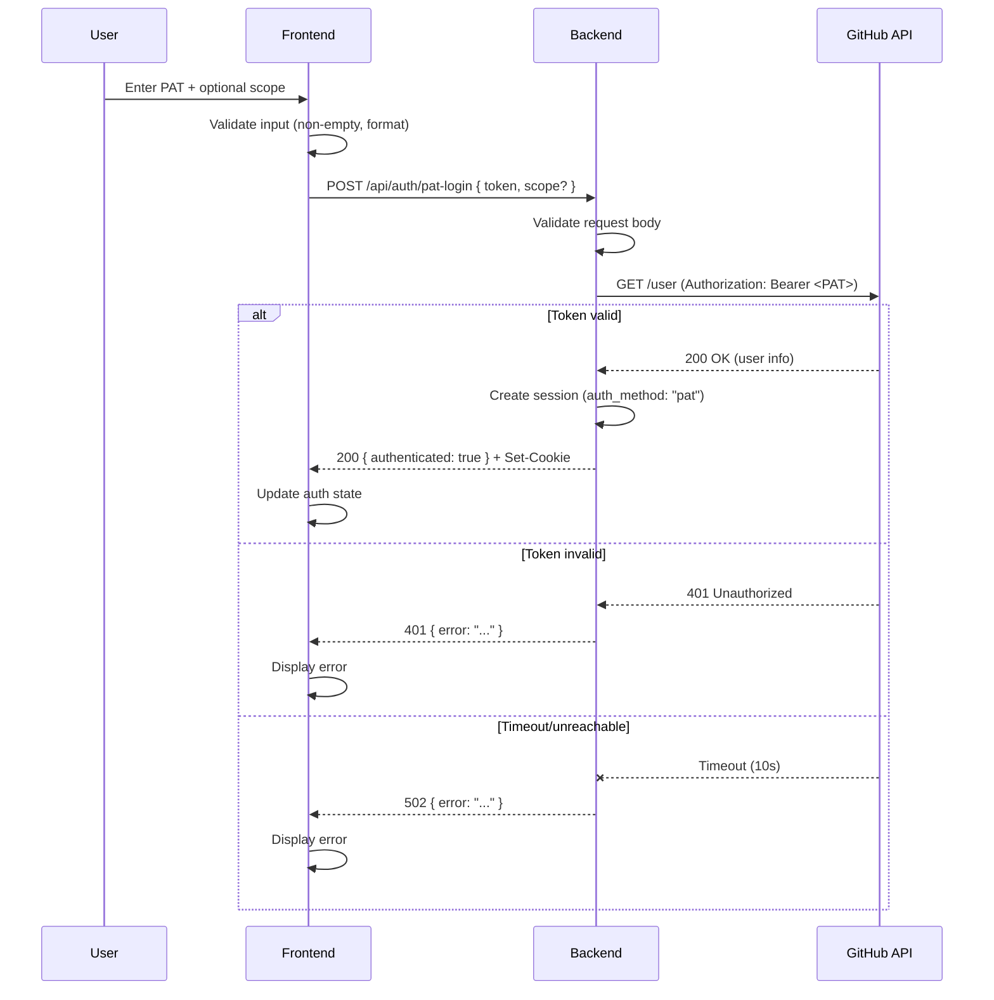
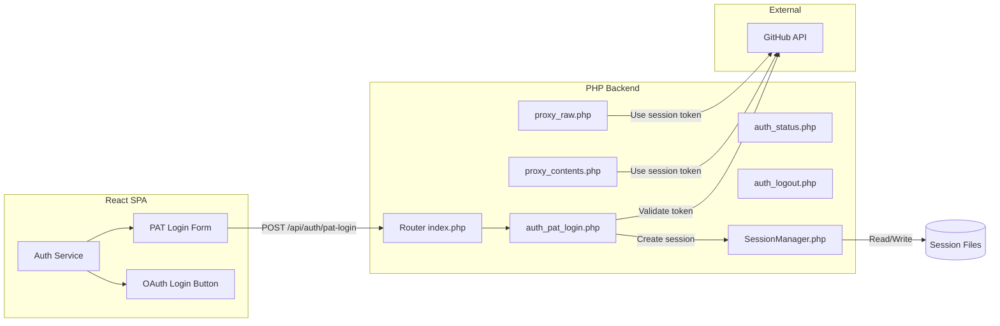

# Design Document: Enterprise Auth Alternative (PAT Authentication)

## Overview

This feature introduces Personal Access Token (PAT) authentication as an alternative to the existing GitHub App OAuth flow. Enterprise users who cannot install GitHub Apps on their organizations can authenticate by providing a GitHub PAT, which the backend validates against the GitHub API and stores in the existing session infrastructure.

The design reuses the existing session management, proxy routing, and cookie-based authentication mechanisms. The PAT is treated as an `installation_token` within the session, allowing all downstream proxy routes to operate identically regardless of how the session was created.

### Key Design Decisions

1. **Session reuse over new infrastructure** — PAT sessions are stored in the same file-based JSON session store with the same structure, adding only an `auth_method` discriminator field. This avoids duplicating proxy route logic.
2. **Backend token validation** — The PAT is validated server-side by calling GitHub's `/user` endpoint, ensuring the frontend never needs to make authenticated GitHub API calls directly.
3. **No client-side token persistence** — The PAT is transmitted once in the request body and immediately discarded from the frontend. Only the session cookie persists client-side.
4. **Optional repository scoping** — Reuses the existing `createScopedSession` mechanism to restrict PAT sessions to specific owner/repo paths.

## Architecture



### System Context



## Components and Interfaces

### Backend Components

#### 1. PAT Login Route (`backend/src/routes/auth_pat_login.php`)

New route handler for `POST /api/auth/pat-login`.

**Responsibilities:**
- Parse and validate JSON request body
- Enforce token length limit (≤ 256 characters)
- Enforce HTTPS in production
- Call GitHub `/user` endpoint to validate the token (10-second timeout)
- Create session via `SessionManager`
- Set session cookie
- Return JSON response

**Interface:**
```
POST /api/auth/pat-login
Content-Type: application/json

Request Body:
{
  "token": string,          // Required. The GitHub PAT.
  "scope": {                // Optional. Repository restriction.
    "owner": string,        // Required if scope is provided.
    "repo": string          // Required if scope is provided.
  }
}

Success Response (200):
{ "authenticated": true }

Error Responses:
  400: { "error": "A valid token is required" }
  400: { "error": "Token format is invalid" }
  400: { "error": "Invalid scope format: owner and repo are required" }
  401: { "error": "Token is invalid or expired" }
  502: { "error": "Unable to verify token: GitHub API is unreachable" }
```

#### 2. Enhanced SessionManager (`backend/src/SessionManager.php`)

Extended with a new method for PAT-specific session creation.

**New Method:**
```php
public function createPatSession(string $pat, ?array $scope = null): string
```

- Stores `auth_method: "pat"` in session data
- Sets `expires_at` to 24 hours from creation (vs 1 hour for OAuth)
- If `$scope` is provided, stores it as `{ owner, repo }` for scope enforcement
- Validates that `$pat` is non-empty and non-whitespace
- Returns the session token string

**Modified Method:**
```php
public function createSession(string $accessToken): string
```

- Now stores `auth_method: "oauth"` in session data (backward-compatible addition)

#### 3. Enhanced Auth Status Route (`backend/src/routes/auth_status.php`)

Modified to include `auth_method` in the response when a valid session exists.

**Updated Response:**
```json
// Authenticated (OAuth)
{ "authenticated": true, "auth_method": "oauth" }

// Authenticated (PAT)
{ "authenticated": true, "auth_method": "pat" }

// Not authenticated
{ "authenticated": false }
```

#### 4. Router Update (`backend/public/index.php`)

Add route case for the new PAT login endpoint:
```php
case $method === 'POST' && $path === '/api/auth/pat-login':
    require APP_BASE . '/src/routes/auth_pat_login.php';
    break;
```

### Frontend Components

#### 5. PAT Login Form Component (`src/components/PatLoginForm.tsx`)

New React component for the PAT login interface.

**Props:**
```typescript
interface PatLoginFormProps {
  onSuccess: () => void;
  onCancel: () => void;
}
```

**Behavior:**
- Renders a password-masked input for the PAT (maxLength: 255)
- Renders an optional text input for repository scope (`owner/repo` format, maxLength: 256)
- Validates inputs client-side before submission
- Calls `authService.loginWithPat(token, scope?)` on submit
- Clears the PAT input field immediately after submission (before next render frame)
- Displays error messages from failed login attempts
- Includes a link to GitHub PAT documentation

#### 6. Enhanced Auth Service (`src/services/auth-service.ts`)

New method added to the `AuthService` interface and implementation.

**New Method:**
```typescript
loginWithPat(token: string, scope?: { owner: string; repo: string }): Promise<AuthResult>;
```

- Sends `POST` to `/api/auth/pat-login` with `{ token, scope }` in the body
- Uses `credentials: 'include'` for cookie handling
- Returns `AuthResult` (success or error with message)
- On success, updates `localStorage` auth flag

**Updated Interface:**
```typescript
export interface AuthService {
  // Existing methods...
  initiateOAuth(returnUrl: string): void;
  handleOAuthCallback(code: string, state: string): Promise<AuthResult>;
  isAuthenticated(): boolean;
  logout(): Promise<void>;
  getBackendUrl(): string | null;
  isPrivateAccessAvailable(): boolean;
  
  // New method
  loginWithPat(token: string, scope?: { owner: string; repo: string }): Promise<AuthResult>;
}
```

#### 7. Updated InputView (`src/views/InputView.tsx`)

Modified to show both OAuth and PAT login options when unauthenticated.

**Changes:**
- When `showAuthPrompt` is true and private access is available, display two buttons: "Connect GitHub" (OAuth) and "Use Personal Access Token" (PAT)
- Selecting PAT shows the `PatLoginForm` component inline
- On PAT login success, re-attempt the URL fetch

## Data Models

### Session Data (File-based JSON)

**OAuth Session (existing + auth_method):**
```json
{
  "installation_token": "ghu_...",
  "auth_method": "oauth",
  "created_at": 1700000000,
  "expires_at": 1700003600
}
```

**PAT Session (unscoped):**
```json
{
  "installation_token": "ghp_...",
  "auth_method": "pat",
  "created_at": 1700000000,
  "expires_at": 1700086400
}
```

**PAT Session (scoped):**
```json
{
  "installation_token": "ghp_...",
  "auth_method": "pat",
  "created_at": 1700000000,
  "expires_at": 1700086400,
  "scope": {
    "owner": "my-org",
    "repo": "my-repo"
  }
}
```

**Key differences from OAuth sessions:**
| Field | OAuth | PAT |
|-------|-------|-----|
| `auth_method` | `"oauth"` | `"pat"` |
| `expires_at` | created_at + 3600 (1 hour) | created_at + 86400 (24 hours) |
| `scope` | Only via share flow (includes branch/path) | Optional (owner/repo only) |

### Request/Response Types (Frontend)

```typescript
// New types in src/types/auth.ts
interface PatLoginRequest {
  token: string;
  scope?: {
    owner: string;
    repo: string;
  };
}

interface AuthStatusResponse {
  authenticated: boolean;
  auth_method?: 'oauth' | 'pat';
}
```

## Correctness Properties

*A property is a characteristic or behavior that should hold true across all valid executions of a system—essentially, a formal statement about what the system should do. Properties serve as the bridge between human-readable specifications and machine-verifiable correctness guarantees.*

### Property 1: Invalid input rejection

*For any* request body that is not valid JSON, or where the `token` field is missing, empty, not a string, contains only whitespace, or exceeds 256 characters, the PAT login endpoint SHALL respond with HTTP 400 and SHALL NOT create a session.

**Validates: Requirements 1.4, 1.7, 2.5**

### Property 2: PAT session data integrity

*For any* valid PAT string that passes GitHub validation, the created session file SHALL contain the PAT as `installation_token`, `auth_method` set to `"pat"`, `created_at` set to the current time, and `expires_at` set to exactly 24 hours after `created_at`.

**Validates: Requirements 1.2, 2.1, 2.2, 2.3**

### Property 3: Invalid token rejection

*For any* token string where GitHub's `/user` endpoint returns a 401 response, the PAT login endpoint SHALL respond with HTTP 401 and SHALL NOT create a session or set a cookie.

**Validates: Requirements 1.5**

### Property 4: Auth status reflects session type

*For any* valid session (PAT or OAuth), the `/api/auth/status` endpoint SHALL return `{ "authenticated": true, "auth_method": "<type>" }` where `<type>` matches the `auth_method` stored in the session data.

**Validates: Requirements 4.1, 4.2**

### Property 5: Missing or expired sessions return unauthenticated

*For any* request to `/api/auth/status` where the session cookie is absent, references a non-existent session file, or references an expired session, the response SHALL be `{ "authenticated": false }` with no `auth_method` field present.

**Validates: Requirements 4.4, 4.5**

### Property 6: PAT never leaked in responses

*For any* PAT value submitted to the login endpoint, regardless of whether authentication succeeds or fails, the PAT value SHALL NOT appear in any HTTP response body returned by the backend.

**Validates: Requirements 5.2**

### Property 7: Scope enforcement on proxy requests

*For any* scoped PAT session with a defined `owner`/`repo` scope, and *for any* proxy request (contents or raw) targeting a different owner or repo, the backend SHALL respond with HTTP 403.

**Validates: Requirements 6.2**

### Property 8: Invalid scope format rejection

*For any* PAT login request where the `scope` field is present but does not contain both a non-empty `owner` and a non-empty `repo` value, the backend SHALL respond with HTTP 400.

**Validates: Requirements 6.4**

### Property 9: Proxy route session-type agnosticism

*For any* two sessions (one PAT, one OAuth) storing the same `installation_token` value and targeting the same GitHub resource, the proxy routes SHALL produce identical responses (same status code and body) for both sessions.

**Validates: Requirements 2.4**

### Property 10: Frontend whitespace-only PAT rejection

*For any* string composed entirely of whitespace characters, the frontend PAT login form SHALL disable the submit action and SHALL NOT send a request to the backend.

**Validates: Requirements 3.3**

### Property 11: Frontend repository scope format validation

*For any* string entered in the repository restriction field that does not match the pattern of exactly one forward slash separating two non-empty segments, the frontend SHALL display a validation error and prevent form submission.

**Validates: Requirements 6.6**

### Property 12: Frontend PAT transmission security

*For any* PAT value submitted via the login form, the PAT SHALL appear only in the POST request body and SHALL NOT be present in URL parameters, request headers (other than Content-Type), localStorage, sessionStorage, or cookies at any point.

**Validates: Requirements 5.5, 5.6**

### Property 13: Logout destroys PAT sessions

*For any* PAT-based session, sending a POST to `/api/auth/logout` SHALL delete the session file from disk and clear the session cookie, returning `{ "authenticated": false }`.

**Validates: Requirements 7.1**

### Property 14: Frontend error display for failed PAT login

*For any* HTTP error response (4xx or 5xx) from the PAT login endpoint containing an error message, the frontend SHALL display that error message to the user.

**Validates: Requirements 3.6**

## Error Handling

### Backend Error Handling

| Scenario | HTTP Status | Response | Notes |
|----------|-------------|----------|-------|
| Invalid/missing JSON body | 400 | `{ "error": "A valid token is required" }` | PAT value must NOT appear in error |
| Token exceeds 256 chars | 400 | `{ "error": "Token format is invalid" }` | Reject before any API call |
| Invalid scope format | 400 | `{ "error": "Invalid scope format: owner and repo are required" }` | |
| HTTPS required (production) | 400 | `{ "error": "Secure connection required" }` | Only in production mode |
| GitHub returns 401 | 401 | `{ "error": "Token is invalid or expired" }` | PAT value must NOT appear |
| GitHub timeout (10s) | 502 | `{ "error": "Unable to verify token: GitHub API is unreachable" }` | |
| GitHub unreachable | 502 | `{ "error": "Unable to verify token: GitHub API is unreachable" }` | |
| Session creation failure | 500 | `{ "error": "Internal server error" }` | Log internally, don't expose details |

### Frontend Error Handling

| Scenario | User-Facing Behavior |
|----------|---------------------|
| Network error during PAT login | Display "Unable to reach the server. Check your connection and try again." |
| 400 from backend | Display the error message from the response body |
| 401 from backend | Display "The token is invalid or expired. Please check your token and try again." |
| 502 from backend | Display "Unable to verify token. GitHub may be temporarily unavailable." |
| Timeout (no response) | Display "Request timed out. Please try again." |

### Security Error Handling Principles

1. **Never echo the PAT** — Error responses must not include the submitted token value
2. **Generic messages for server errors** — Internal failures return generic messages; details are logged server-side only
3. **Clear input on any submission** — The PAT field is cleared immediately after form submission regardless of outcome
4. **No retry with stored token** — If login fails, the user must re-enter their token

## Testing Strategy

### Property-Based Testing (using `fast-check`)

The project already includes `fast-check` as a dev dependency. Property-based tests will validate the correctness properties defined above with a minimum of 100 iterations per property.

**Backend properties** (tested via integration-style tests or unit tests with mocked GitHub API):
- Properties 1–9, 13: Test session creation logic, input validation, scope enforcement, and auth status responses
- Use PHP unit testing (PHPUnit) or test the endpoints via HTTP with a test harness

**Frontend properties** (tested via Vitest + fast-check):
- Properties 10–12, 14: Test input validation, form behavior, fetch call construction, and error display
- Mock `fetch` to verify request structure and response handling

**Tag format for property tests:**
```typescript
// Feature: enterprise-auth-alternative, Property 1: Invalid input rejection
```

### Unit Tests (Example-Based)

- Cookie attributes (httpOnly, Secure, SameSite=Strict) on successful PAT login
- HTTPS enforcement in production mode
- GitHub PAT documentation link presence in UI
- PAT input field has `type="password"` and `maxLength=255`
- Successful auth state update on 200 response
- Network error message display

### Integration Tests

- End-to-end PAT login flow with real session file creation
- Logout flow for PAT sessions
- Proxy route access with PAT session (same behavior as OAuth session)
- Scoped session creation and enforcement across proxy endpoints

### Test Configuration

```typescript
// vitest property test example
import fc from 'fast-check';

describe('PAT Login Validation', () => {
  it('Property 1: rejects all invalid inputs', () => {
    fc.assert(
      fc.property(
        fc.oneof(
          fc.constant(''),                    // empty
          fc.stringOf(fc.constantFrom(' ', '\t', '\n')), // whitespace-only
          fc.string({ minLength: 257 }),      // too long
        ),
        (invalidToken) => {
          // verify rejection
        }
      ),
      { numRuns: 100 }
    );
  });
});
```
