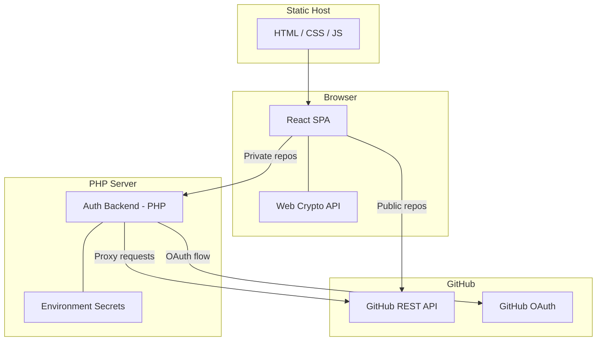
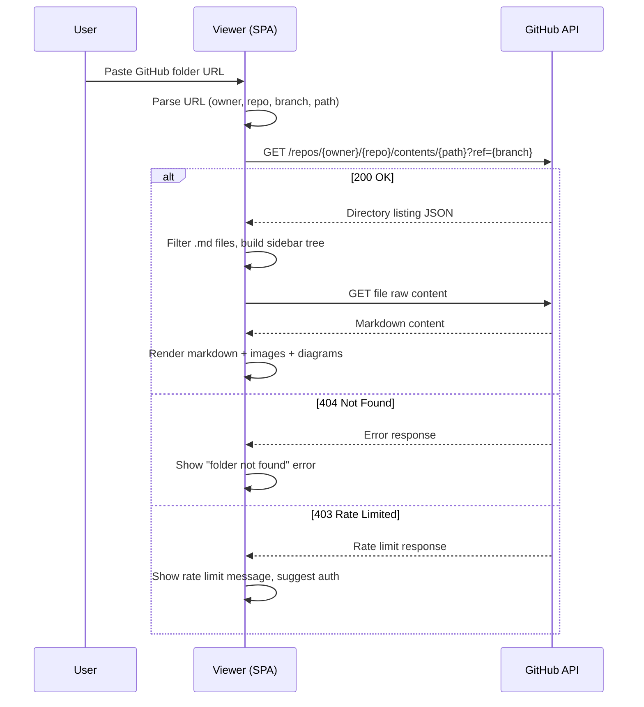
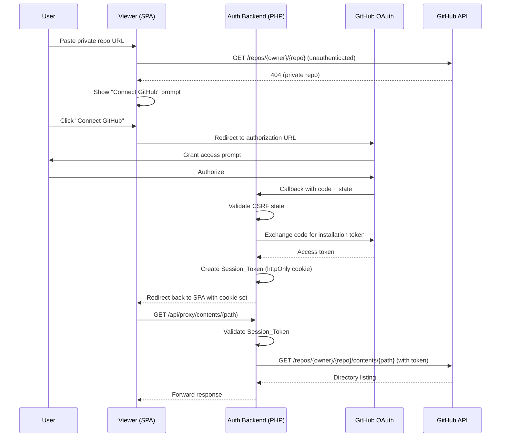
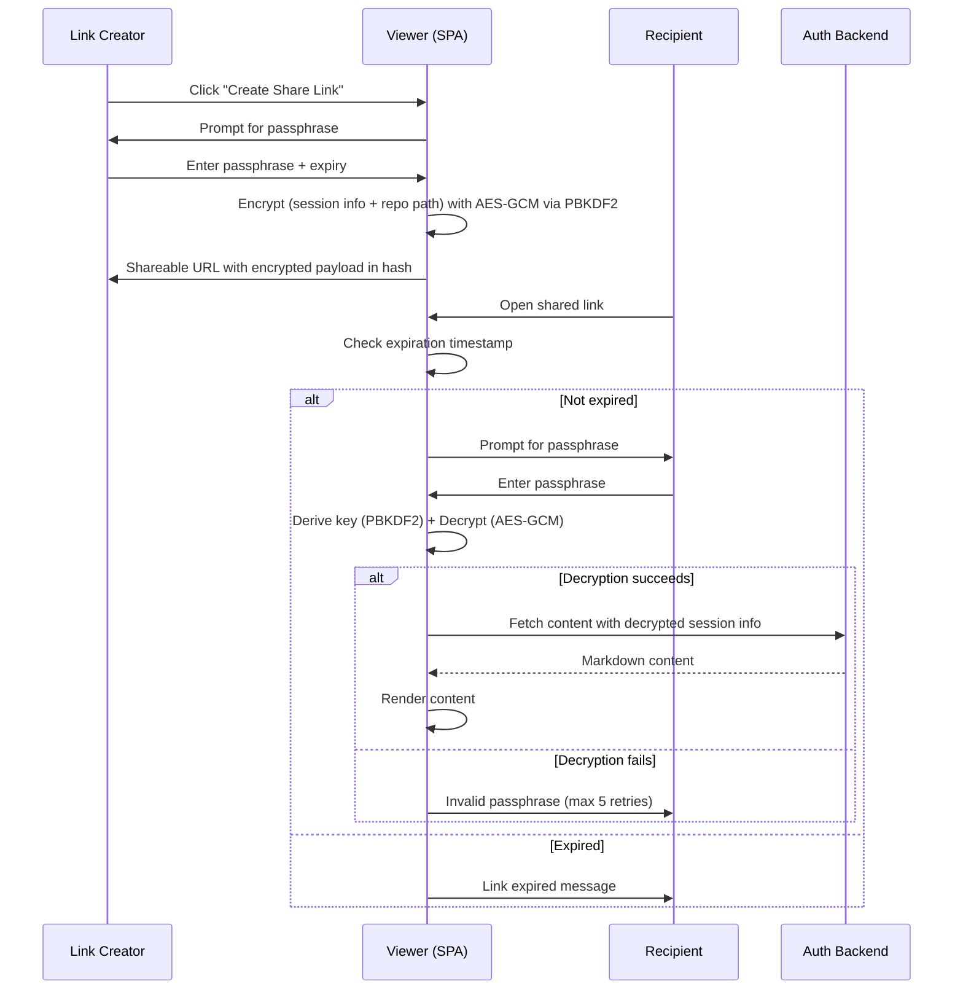
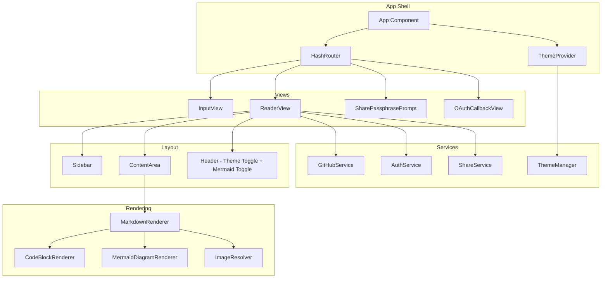

# Design Document: GitHub Markdown Viewer

## Overview

The GitHub Markdown Viewer (ghmd-viewer) is a Single Page Application that fetches and renders Markdown files from a GitHub repository folder. It operates in two modes:

1. **Public mode** — A fully static frontend that uses the unauthenticated GitHub REST API. No backend required.
2. **Private mode** — The static frontend connects to a minimal PHP backend that handles GitHub App OAuth and proxies authenticated API requests.

The application is built with React + TypeScript, styled with shadcn/ui (Tailwind CSS), and uses client-side routing via URL hash fragments for static hosting compatibility.

### Key Design Decisions

| Decision | Rationale |
|----------|-----------|
| React + TypeScript + Vite | Fast build, strong typing, widely supported ecosystem |
| shadcn/ui + Tailwind CSS | Requirement 11 mandates theme support; shadcn has built-in dark mode |
| URL hash-based routing | Requirement 12/13: works on any static file host without server config |
| PHP backend (minimal) | Requirement 4: keeps GitHub App secrets server-side; PHP chosen per user requirement |
| Web Crypto API for share links | Requirement 6: client-side encryption keeps passphrases off the server |
| Mermaid.js (lazy-loaded) | Requirement 10: renders diagrams; lazy-load to keep initial bundle small |
| react-markdown + remark-gfm | Requirement 8: GFM support with plugin ecosystem for syntax highlighting |

## Architecture

### System Architecture Diagram



### Request Flow — Public Repository



### Request Flow — Private Repository (OAuth)



### Request Flow — Shareable Link



## Components and Interfaces

### Frontend Component Architecture



### Component Specifications

#### 1. GitHubService

Handles all GitHub API interactions.

```typescript
interface GitHubService {
  // Parse a GitHub folder URL into components
  parseGitHubUrl(url: string): ParsedGitHubUrl | null;

  // Fetch directory listing (public, unauthenticated)
  fetchPublicContents(owner: string, repo: string, path: string, branch: string): Promise<GitHubContentItem[]>;

  // Fetch directory listing (private, via auth backend proxy)
  fetchPrivateContents(owner: string, repo: string, path: string, branch: string): Promise<GitHubContentItem[]>;

  // Fetch raw file content
  fetchFileContent(owner: string, repo: string, path: string, branch: string, isPrivate: boolean): Promise<string>;

  // Check if a repository is accessible publicly
  checkRepoAccess(owner: string, repo: string): Promise<RepoAccessResult>;

  // Recursively discover .md files up to maxDepth
  discoverMarkdownFiles(owner: string, repo: string, path: string, branch: string, isPrivate: boolean, maxDepth?: number): Promise<FileTreeNode[]>;
}

interface ParsedGitHubUrl {
  owner: string;
  repo: string;
  branch: string;
  path: string;
}

interface GitHubContentItem {
  name: string;
  path: string;
  type: 'file' | 'dir';
  size?: number;
  download_url?: string | null;
}

type RepoAccessResult =
  | { accessible: true; isPrivate: false }
  | { accessible: true; isPrivate: true }
  | { accessible: false; reason: 'not_found' | 'rate_limited' | 'network_error'; message: string };
```

#### 2. AuthService

Manages the GitHub App OAuth flow and session state.

```typescript
interface AuthService {
  // Initiate OAuth flow (redirect to GitHub)
  initiateOAuth(returnUrl: string): void;

  // Handle OAuth callback
  handleOAuthCallback(code: string, state: string): Promise<AuthResult>;

  // Check if user has an active session
  isAuthenticated(): boolean;

  // Logout and clear session
  logout(): Promise<void>;

  // Get the auth backend base URL (null if not configured)
  getBackendUrl(): string | null;

  // Check if private repo features are available
  isPrivateAccessAvailable(): boolean;
}

type AuthResult =
  | { success: true }
  | { success: false; error: 'state_mismatch' | 'exchange_failed' | 'cancelled'; message: string };
```

#### 3. ShareService

Handles passphrase-based encrypted share links.

```typescript
interface ShareService {
  // Create an encrypted share link
  createShareLink(params: ShareLinkParams): Promise<string>;

  // Parse a share link URL and extract encrypted payload
  parseShareLink(hash: string): ShareLinkPayload | null;

  // Decrypt the share payload using a passphrase
  decryptPayload(payload: ShareLinkPayload, passphrase: string): Promise<DecryptResult>;

  // Check if a share link has expired
  isExpired(payload: ShareLinkPayload): boolean;
}

interface ShareLinkParams {
  owner: string;
  repo: string;
  branch: string;
  path: string;
  sessionToken: string;
  passphrase: string;
  expiresInHours: number; // 1-720 (30 days)
}

interface ShareLinkPayload {
  encryptedData: string;   // Base64-encoded ciphertext
  iv: string;              // Base64-encoded initialization vector
  salt: string;            // Base64-encoded PBKDF2 salt
  expiresAt: number;       // Unix timestamp (ms)
  owner: string;
  repo: string;
  branch: string;
  path: string;
}

type DecryptResult =
  | { success: true; sessionToken: string }
  | { success: false; error: 'invalid_passphrase' | 'decryption_error' };
```

#### 4. ThemeManager

Manages dark/light/system theme preferences.

```typescript
interface ThemeManager {
  // Get current effective theme ('light' | 'dark')
  getEffectiveTheme(): 'light' | 'dark';

  // Get user preference ('light' | 'dark' | 'system')
  getPreference(): ThemePreference;

  // Set theme preference
  setPreference(pref: ThemePreference): void;

  // Subscribe to theme changes
  onThemeChange(callback: (theme: 'light' | 'dark') => void): () => void;
}

type ThemePreference = 'light' | 'dark' | 'system';
```

#### 5. MarkdownRenderer (React Component)

```typescript
interface MarkdownRendererProps {
  content: string;
  basePath: string;           // Repo-relative path for resolving relative links/images
  owner: string;
  repo: string;
  branch: string;
  isPrivate: boolean;
  mermaidEnabled: boolean;
  onNavigate: (filePath: string) => void;  // In-app navigation for relative .md links
}
```

#### 6. Sidebar (React Component)

```typescript
interface SidebarProps {
  fileTree: FileTreeNode[];
  activeFilePath: string | null;
  onFileSelect: (filePath: string) => void;
  isLoading: boolean;
}

interface FileTreeNode {
  name: string;
  path: string;
  type: 'file' | 'directory';
  children?: FileTreeNode[];
}
```

### Backend API Endpoints (PHP)

| Endpoint | Method | Description |
|----------|--------|-------------|
| `/api/auth/login` | GET | Initiates OAuth redirect to GitHub |
| `/api/auth/callback` | GET | Handles OAuth callback, sets session cookie |
| `/api/auth/logout` | POST | Invalidates session, clears cookie |
| `/api/auth/status` | GET | Returns current auth status |
| `/api/proxy/contents/{owner}/{repo}/{path}` | GET | Proxies GitHub contents API with auth |
| `/api/proxy/raw/{owner}/{repo}/{path}` | GET | Proxies raw file content with auth |

#### Auth Callback Response Flow

```
GET /api/auth/callback?code=XXX&state=YYY
→ Validate state matches stored CSRF token
→ Exchange code for installation access token
→ Generate Session_Token (random, 1hr expiry)
→ Store session: { token → installation_token, expiry }
→ Set-Cookie: session_token=...; HttpOnly; Secure; SameSite=Strict; Max-Age=3600
→ Redirect to SPA with original hash state
```

#### Proxy Request Flow

```
GET /api/proxy/contents/owner/repo/path?ref=branch
→ Read Session_Token from cookie
→ Validate session exists and not expired
→ Fetch from GitHub API with installation token
→ Return response (or forward error)
→ Timeout: 30 seconds max
```

## Data Models

### URL Hash State Encoding

The application state is encoded in the URL hash for shareability and static hosting compatibility.

```
#/{owner}/{repo}/{branch}/{folderPath}?file={relativeMdFilePath}
```

Examples:
- `#/octocat/docs/main/guides?file=getting-started.md`
- `#/myorg/private-docs/main/api?file=reference/auth.md`

### Share Link URL Format

```
https://host/#/share/{base64url-encoded-payload}
```

The payload encodes a JSON object (ShareLinkPayload) as a base64url string in the hash fragment, keeping all encrypted data client-side.

### localStorage Keys

| Key | Type | Description |
|-----|------|-------------|
| `ghmd-theme` | `'light' \| 'dark' \| 'system'` | User theme preference |
| `ghmd-mermaid-enabled` | `'true' \| 'false'` | Mermaid rendering toggle state |

### Session Storage (PHP Backend — Server-Side)

```php
// In-memory or file-based session store (no database required)
$sessions = [
    'session_token_string' => [
        'installation_token' => 'ghs_xxxx',  // GitHub installation access token
        'created_at' => 1700000000,           // Unix timestamp
        'expires_at' => 1700003600,           // created_at + 3600
    ]
];
```

### GitHub API Response Models

```typescript
// GET /repos/{owner}/{repo}/contents/{path}?ref={branch}
interface GitHubContentsResponse {
  name: string;
  path: string;
  sha: string;
  size: number;
  url: string;
  html_url: string;
  git_url: string;
  download_url: string | null;
  type: 'file' | 'dir' | 'symlink' | 'submodule';
  content?: string;        // Base64-encoded for files < 1MB
  encoding?: 'base64';
}
```

### Error State Model

```typescript
interface AppError {
  type: 'network' | 'not_found' | 'rate_limited' | 'auth_required' | 'auth_failed' | 'invalid_url' | 'render_error' | 'share_expired' | 'share_invalid';
  message: string;
  retryable: boolean;
  action?: 'retry' | 'authenticate' | 'enter_passphrase' | 'new_url';
}
```


## Correctness Properties

*A property is a characteristic or behavior that should hold true across all valid executions of a system — essentially, a formal statement about what the system should do. Properties serve as the bridge between human-readable specifications and machine-verifiable correctness guarantees.*

### Property 1: URL Parsing Round-Trip

*For any* valid GitHub folder URL in the format `https://github.com/{owner}/{repo}/tree/{branch}/{path}` (where owner, repo, branch, and path are non-empty strings with valid characters), parsing the URL SHALL produce a ParsedGitHubUrl object whose fields, when recombined into the URL format, produce the original URL.

**Validates: Requirements 1.2, 1.4**

### Property 2: Invalid URL Rejection

*For any* string that does not match the GitHub folder URL format (including empty strings, whitespace-only strings, non-GitHub domains, missing path segments, and malformed URLs), the URL parser SHALL return null.

**Validates: Requirements 1.3, 1.7**

### Property 3: Case-Insensitive Markdown File Filtering

*For any* array of GitHubContentItem objects, the markdown filter function SHALL return exactly those items whose name ends with `.md` (case-insensitive comparison), and no others.

**Validates: Requirements 2.2**

### Property 4: Recursive Discovery Depth Limit

*For any* directory tree structure (regardless of nesting depth), the discoverMarkdownFiles function SHALL never return files at a depth greater than 10 levels from the root folder, and SHALL return all `.md` files within those 10 levels.

**Validates: Requirements 2.5**

### Property 5: Session Token Expiry Constraint

*For any* session token created by the Auth_Backend, the expiry timestamp SHALL be no more than 3600 seconds after the creation timestamp.

**Validates: Requirements 4.3**

### Property 6: Passphrase Length Validation

*For any* string shorter than 8 characters, the Share_Service SHALL reject it as an invalid passphrase. *For any* string of 8 or more characters, the Share_Service SHALL accept it as a valid passphrase.

**Validates: Requirements 6.2**

### Property 7: Share Link Structure Round-Trip

*For any* valid ShareLinkParams (owner, repo, branch, path, sessionToken, passphrase >= 8 chars, expiresInHours in [1, 720]), creating a share link and then parsing it back SHALL produce a ShareLinkPayload containing the original owner, repo, branch, and path values.

**Validates: Requirements 6.3**

### Property 8: Encryption/Decryption Round-Trip

*For any* plaintext session token and any valid passphrase (>= 8 characters), encrypting with AES-GCM (PBKDF2-derived key) and then decrypting with the same passphrase SHALL return the original session token.

**Validates: Requirements 6.4, 6.6**

### Property 9: Wrong Passphrase Decryption Failure

*For any* encrypted payload and any passphrase that differs from the encryption passphrase, decryption SHALL fail and return an error result (never produce the original plaintext).

**Validates: Requirements 6.7**

### Property 10: Expiration Range Validation

*For any* expiration value less than 1 or greater than 720 (hours), the Share_Service SHALL reject it. *For any* value in [1, 720], the Share_Service SHALL accept it.

**Validates: Requirements 6.8**

### Property 11: Expiration Timestamp Check

*For any* ShareLinkPayload with an expiresAt timestamp before the current time, isExpired SHALL return true. *For any* payload with expiresAt after the current time, isExpired SHALL return false.

**Validates: Requirements 6.9**

### Property 12: File Tree Hierarchy Correctness

*For any* set of file paths (with directory separators), building a file tree SHALL produce a structure where every file appears exactly once at the correct nesting level, and every intermediate directory exists as a parent node.

**Validates: Requirements 7.2**

### Property 13: Link Classification and Resolution

*For any* relative path ending in `.md`, the link resolver SHALL produce an in-app navigation path (not an external link). *For any* absolute URL (starting with `http://` or `https://`), the link resolver SHALL mark it as an external link to be opened in a new tab.

**Validates: Requirements 8.6, 8.7**

### Property 14: Image URL Resolution

*For any* relative image path in a public repo, the image resolver SHALL produce a URL pointing to `https://raw.githubusercontent.com/{owner}/{repo}/{branch}/{resolvedPath}`. *For any* relative image path in a private repo, the resolver SHALL produce a URL pointing to the Auth_Backend proxy endpoint. *For any* absolute image URL, the resolver SHALL return it unchanged.

**Validates: Requirements 9.1, 9.2, 9.5**

### Property 15: Mermaid Toggle Persistence

*For any* boolean value set on the Mermaid rendering toggle, the value SHALL be persisted to localStorage, and upon re-initialization the toggle SHALL reflect the persisted value.

**Validates: Requirements 10.3**

### Property 16: Theme Preference Cycle

*For any* starting theme preference, cycling the Theme_Manager SHALL follow the sequence light → dark → system → light (wrapping). The effective theme SHALL always be 'light' or 'dark' (never 'system' as an applied class).

**Validates: Requirements 11.1**

### Property 17: Theme Persistence and Invalid Fallback

*For any* valid theme preference ('light', 'dark', 'system'), persisting to localStorage and re-initializing SHALL restore the same preference. *For any* string that is not a valid theme preference, the Theme_Manager SHALL fall back to the OS color scheme and remove the invalid entry from localStorage.

**Validates: Requirements 11.3, 11.5**

### Property 18: URL Hash State Round-Trip

*For any* navigation state (owner, repo, branch, folder path, file path), encoding it into a URL hash and then parsing that hash SHALL produce the original state components.

**Validates: Requirements 13.1**

## Error Handling

### Error Categories and Responses

| Error Type | Source | User-Facing Message | Recovery Action |
|-----------|--------|--------------------|-----------------| 
| `network` | Fetch failures, timeouts | "Network error. Please check your connection." | Retry button |
| `not_found` | GitHub 404 | "Folder or file not found. Check the URL." | Show URL input |
| `rate_limited` | GitHub 403 + rate-limit headers | "GitHub rate limit reached. Authenticate for higher limits." | "Connect GitHub" button |
| `auth_required` | Backend 401, private repo detection | "This is a private repository. Connect GitHub to access." | "Connect GitHub" button |
| `auth_failed` | OAuth error, token exchange failure | "Authentication failed. Please try again." | Retry OAuth button |
| `invalid_url` | URL parse failure | "Invalid URL format. Expected: https://github.com/owner/repo/tree/branch/path" | Highlight input |
| `render_error` | Mermaid timeout, markdown parse error | "Failed to render content." | Show raw source |
| `share_expired` | Expired share link | "This shared link has expired." | No recovery |
| `share_invalid` | Wrong passphrase | "Invalid passphrase. {N} attempts remaining." | Retry passphrase input |

### Error Handling Strategy

1. **Network errors**: All fetch calls wrapped in try/catch. Display error with retry. Use exponential backoff for retries (max 3 attempts).
2. **GitHub API errors**: Map HTTP status codes to AppError types. Forward rate-limit reset time to user.
3. **Auth errors**: On 401 from backend, clear session state and show re-auth prompt. Never expose previously fetched private content after session expiry.
4. **Rendering errors**: Mermaid and markdown rendering failures should never crash the app. Catch errors, show raw source as fallback.
5. **Share link errors**: Expired links reject immediately (no decryption attempt). Wrong passphrase allows 5 retries then 60s lockout.
6. **Timeout handling**: GitHub API proxy = 30s timeout. Image loading = 10s timeout. Mermaid rendering = 5s timeout.

### Error Boundaries

- A React Error Boundary wraps the ContentArea to prevent rendering crashes from propagating to the full app.
- The Sidebar and Header remain functional even when content rendering fails.

## Testing Strategy

### Testing Framework

- **Unit & Integration Tests**: Vitest (fast, Vite-native, TypeScript support)
- **Property-Based Tests**: fast-check (JavaScript PBT library, integrates with Vitest)
- **Component Tests**: React Testing Library + Vitest
- **E2E Tests** (optional): Playwright for critical user flows

### Property-Based Tests

Each correctness property (Properties 1–18) SHALL be implemented as a property-based test using fast-check with a minimum of 100 iterations.

Each test SHALL be tagged with a comment referencing its design property:
```typescript
// Feature: github-md-viewer, Property 1: URL Parsing Round-Trip
```

**Tag format**: `Feature: github-md-viewer, Property {number}: {property_text}`

Key property test areas:
- **URL parsing** (Properties 1-2): Generate random valid/invalid URL strings
- **Share service crypto** (Properties 7-11): Generate random passphrases, session tokens, expiration values
- **File tree building** (Property 12): Generate random file path sets
- **Link/image resolution** (Properties 13-14): Generate random relative/absolute paths
- **Preference persistence** (Properties 15-18): Generate random preference values and invalid strings

### Unit Tests (Example-Based)

Focus on specific scenarios not covered by property tests:
- GitHub API response handling (mocked: 200, 403, 404 responses)
- OAuth flow steps (redirect URL construction, callback handling)
- Error state transitions
- Responsive sidebar behavior at breakpoints
- GFM rendering (tables, task lists, strikethrough)
- Code block syntax highlighting presence/absence

### Integration Tests

- Auth Backend PHP endpoints (OAuth callback, proxy, logout)
- GitHub API proxy with mocked upstream
- Session token validation and expiry

### Test Organization

```
tests/
├── unit/
│   ├── url-parser.test.ts          # Properties 1-2
│   ├── md-filter.test.ts           # Property 3
│   ├── tree-discovery.test.ts      # Property 4
│   ├── share-service.test.ts       # Properties 6-11
│   ├── file-tree.test.ts           # Property 12
│   ├── link-resolver.test.ts       # Property 13
│   ├── image-resolver.test.ts      # Property 14
│   ├── theme-manager.test.ts       # Properties 16-17
│   ├── url-state.test.ts           # Property 18
│   └── mermaid-toggle.test.ts      # Property 15
├── components/
│   ├── sidebar.test.tsx
│   ├── markdown-renderer.test.tsx
│   ├── input-view.test.tsx
│   └── share-prompt.test.tsx
├── integration/
│   ├── github-service.test.ts
│   ├── auth-flow.test.ts
│   └── backend-proxy.test.ts  (PHP)
└── e2e/
    ├── public-repo-flow.spec.ts
    └── private-repo-flow.spec.ts
```
