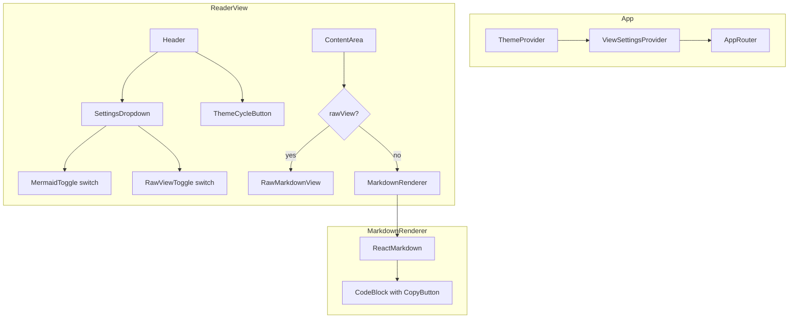

# Design Document: Markdown Viewer Enhancements

## Overview

This design covers three enhancements to the GitHub Markdown Viewer frontend application:

1. **Copy-to-clipboard buttons on code blocks** — An overlay button on each fenced code block that copies the raw text content to the system clipboard with visual feedback.
2. **Raw markdown view toggle** — A switch control that swaps the content area between the rendered HTML output and the unprocessed markdown source text.
3. **Unified settings dropdown** — A single dropdown menu in the Header that consolidates the Mermaid diagram toggle and the new raw view toggle into switch-style controls, replacing the standalone Mermaid button.

These features operate entirely in the frontend React/TypeScript layer. No backend changes are needed.

### Design Decisions

| Decision | Rationale |
|----------|-----------|
| Use `navigator.clipboard.writeText()` for copy | Modern API with broad browser support; graceful no-op on failure per requirements. |
| Raw view as a sibling component to MarkdownRenderer | Keeps MarkdownRenderer unchanged; raw view is a simple `<pre>` element conditionally rendered in ReaderView. |
| shadcn/ui DropdownMenu for settings | Requirement 3.10 explicitly mandates shadcn/ui; ensures consistent look-and-feel with the existing Button component. |
| Extend MermaidProvider into a broader ViewSettingsProvider | Consolidates localStorage persistence for both toggles in one React context, avoiding prop-drilling. |
| lucide-react `SlidersHorizontal` icon for trigger | Clean, recognizable settings icon from the already-installed lucide-react library. |

---

## Architecture



### Component Hierarchy Changes

- `MermaidProvider` is renamed/extended to `ViewSettingsProvider` which manages both `mermaidEnabled` and `rawViewEnabled` state with localStorage persistence.
- `Header` replaces the standalone Mermaid toggle button with a `SettingsDropdown` component.
- `MarkdownRenderer`'s custom `pre` component is enhanced to wrap each fenced code block in a positioned container that includes a `CopyButton`.
- `ReaderView` conditionally renders either `MarkdownRenderer` or a new `RawMarkdownView` component based on context state.

---

## Components and Interfaces

### 1. ViewSettingsProvider (replaces MermaidProvider)

```typescript
// src/components/ViewSettingsProvider.tsx
interface ViewSettingsContextValue {
  mermaidEnabled: boolean
  setMermaidEnabled: (enabled: boolean) => void
  toggleMermaid: () => void
  rawViewEnabled: boolean
  setRawViewEnabled: (enabled: boolean) => void
  toggleRawView: () => void
}
```

**Behavior:**
- Reads initial state from `localStorage` keys: `ghmd-mermaid-enabled` (default `true`) and `ghmd-raw-view` (default `false`).
- Writes state changes to `localStorage` immediately.
- If `localStorage` is unavailable, defaults are used and writes are silently skipped.
- Exposes the context via a `useViewSettings()` hook.

### 2. SettingsDropdown

```typescript
// src/components/SettingsDropdown.tsx
export function SettingsDropdown(): JSX.Element
```

**Behavior:**
- Renders a trigger button with `SlidersHorizontal` icon and `aria-label="Display settings"`.
- Opens a `DropdownMenu` (shadcn/ui) containing two labeled switch rows:
  - "Mermaid Diagrams" — toggles `mermaidEnabled`
  - "Raw Markdown" — toggles `rawViewEnabled`
- Closes on outside click or Escape, returning focus to the trigger.
- Fully keyboard accessible (Enter/Space to open, Tab/Arrow to navigate, Enter/Space to toggle).

### 3. CopyButton

```typescript
// src/components/CopyButton.tsx
interface CopyButtonProps {
  text: string // raw code text to copy
}

export function CopyButton({ text }: CopyButtonProps): JSX.Element
```

**Behavior:**
- Renders a button (min 32×32px) with `aria-label="Copy code to clipboard"`.
- On click: calls `navigator.clipboard.writeText(text)`.
- On success: shows a checkmark icon for 2 seconds via internal state timer, then reverts to copy icon.
- On re-click during confirmation: re-copies and restarts the timer.
- On failure: reverts immediately to default icon (no success indicator).
- Keyboard accessible (focusable, activatable with Enter/Space).

### 4. CodeBlockWrapper

```typescript
// src/components/CodeBlockWrapper.tsx
interface CodeBlockWrapperProps {
  children: React.ReactNode
  rawText: string
}

export function CodeBlockWrapper({ children, rawText }: CodeBlockWrapperProps): JSX.Element
```

**Behavior:**
- Wraps `<pre>` elements in a `position: relative` container.
- Places `CopyButton` at `position: absolute; top-right` within the container.
- Only renders for fenced code blocks (pre > code), not inline code spans.

### 5. RawMarkdownView

```typescript
// src/components/RawMarkdownView.tsx
interface RawMarkdownViewProps {
  content: string
}

export function RawMarkdownView({ content }: RawMarkdownViewProps): JSX.Element
```

**Behavior:**
- Renders the raw markdown source in a `<pre><code>` element with monospace font.
- No syntax highlighting, no HTML rendering, no markdown processing.
- Scrollable container matching the content area dimensions.

---

## Data Models

### localStorage Keys

| Key | Type | Default | Description |
|-----|------|---------|-------------|
| `ghmd-mermaid-enabled` | `"true" \| "false"` | `"true"` | Mermaid diagram rendering toggle state |
| `ghmd-raw-view` | `"true" \| "false"` | `"false"` | Raw markdown view toggle state |

### State Shape (ViewSettingsContext)

```typescript
interface ViewSettingsState {
  mermaidEnabled: boolean  // true = render diagrams, false = show code blocks
  rawViewEnabled: boolean  // true = show raw source, false = show rendered output
}
```

### CopyButton Internal State

```typescript
interface CopyButtonState {
  status: 'idle' | 'copied' // drives icon display
  timerId: ReturnType<typeof setTimeout> | null // for 2-second reset
}
```

No new backend API models or database schemas are required — all state is client-side.

---

## Correctness Properties

*A property is a characteristic or behavior that should hold true across all valid executions of a system — essentially, a formal statement about what the system should do. Properties serve as the bridge between human-readable specifications and machine-verifiable correctness guarantees.*

### Property 1: Code text extraction round-trip

*For any* string of source code that is rendered with syntax highlighting (wrapped in HTML `<span>` elements by rehype-highlight), extracting the `textContent` from the resulting DOM element SHALL produce a string identical to the original source code.

**Validates: Requirements 1.3**

### Property 2: Copy button placement correctness

*For any* markdown document containing a mix of fenced code blocks and inline code spans, the rendered output SHALL contain a copy button inside every `<pre>` element (fenced code blocks) and SHALL NOT contain a copy button adjacent to or inside any inline `<code>` element that is not a child of a `<pre>`.

**Validates: Requirements 1.8**

### Property 3: Raw view identity

*For any* markdown content string, when `rawViewEnabled` is `true`, the text content displayed in the raw view container SHALL be character-for-character identical to the input content string — no characters added, removed, or transformed.

**Validates: Requirements 2.4**

### Property 4: Settings persistence round-trip

*For any* pair of boolean values `(mermaidEnabled, rawViewEnabled)`, writing them to localStorage via `ViewSettingsProvider` and then re-reading them (simulating a page reload by re-initializing the provider) SHALL produce the same pair of boolean values.

**Validates: Requirements 2.5, 3.11**

### Property 5: Toggle is self-inverse

*For any* initial boolean state and any even number of toggle invocations on either the Mermaid or raw view toggle, the resulting state SHALL equal the initial state. Equivalently, toggling twice returns to the original state (toggle is its own inverse).

**Validates: Requirements 3.5, 3.6**

---

## Error Handling

| Scenario | Handling |
|----------|----------|
| `navigator.clipboard.writeText()` rejects (permission denied, insecure context) | Catch the promise rejection silently. CopyButton reverts to idle state — no success icon, no error UI. Requirement 1.6 explicitly forbids showing a success indicator on failure. |
| `localStorage` unavailable (private browsing, quota exceeded) | Wrap all `localStorage` calls in try/catch. Use in-memory defaults (`mermaidEnabled: true`, `rawViewEnabled: false`). State still works within the session but won't persist across reloads. |
| `navigator.clipboard` API not available (very old browsers) | Check for `navigator.clipboard` existence before calling. If unavailable, CopyButton renders but clicking does nothing (graceful degradation). Could optionally fall back to `document.execCommand('copy')` with a hidden textarea. |
| Timer cleanup on unmount | Clear any pending `setTimeout` in CopyButton's cleanup function (useEffect return) to prevent state updates on unmounted components. |
| Dropdown focus management | shadcn/ui DropdownMenu handles focus trapping and restoration internally. No additional error handling needed. |

---

## Testing Strategy

### Unit Tests (example-based)

| Test | Validates |
|------|-----------|
| CopyButton renders with correct aria-label and min 32×32px | Req 1.1, 1.7 |
| CopyButton shows checkmark icon after successful copy, reverts after 2s | Req 1.4 |
| CopyButton re-click during confirmation restarts timer | Req 1.5 |
| CopyButton handles clipboard failure gracefully | Req 1.6 |
| SettingsDropdown opens on click, shows both toggles with correct labels | Req 3.2, 3.3, 3.4 |
| SettingsDropdown closes on Escape, returns focus to trigger | Req 3.7 |
| SettingsDropdown trigger has correct aria-label and icon | Req 3.8 |
| SettingsDropdown keyboard navigation works (Tab, Arrow, Enter/Space) | Req 3.9 |
| RawMarkdownView renders content in monospace pre/code element | Req 2.1 |
| Switching views resets scroll position to top | Req 2.3 |
| Selecting a new file preserves current view toggle state | Req 2.6 |
| Header no longer has standalone Mermaid button | Req 3.1 |

### Property-Based Tests (fast-check)

The project already includes `fast-check` as a dev dependency. Each property test SHALL run a minimum of 100 iterations.

| Property Test | Tag | Validates |
|---------------|-----|-----------|
| Text extraction round-trip | `Feature: markdown-viewer-enhancements, Property 1: Code text extraction round-trip` | Req 1.3 |
| Copy button placement correctness | `Feature: markdown-viewer-enhancements, Property 2: Copy button placement correctness` | Req 1.8 |
| Raw view identity | `Feature: markdown-viewer-enhancements, Property 3: Raw view identity` | Req 2.4 |
| Settings persistence round-trip | `Feature: markdown-viewer-enhancements, Property 4: Settings persistence round-trip` | Req 2.5, 3.11 |
| Toggle is self-inverse | `Feature: markdown-viewer-enhancements, Property 5: Toggle is self-inverse` | Req 3.5, 3.6 |

### Test Configuration

- **Framework**: Vitest (already configured with jsdom environment)
- **PBT Library**: fast-check (already installed as dev dependency)
- **Minimum iterations**: 100 per property test
- **Mocking**: `navigator.clipboard` mocked via `vi.stubGlobal`; `localStorage` mocked via jsdom or custom mock
- **Test location**: `tests/` directory per existing vitest config

