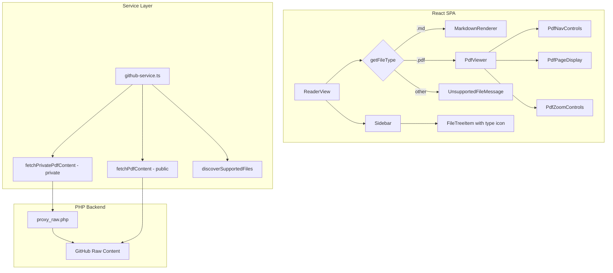
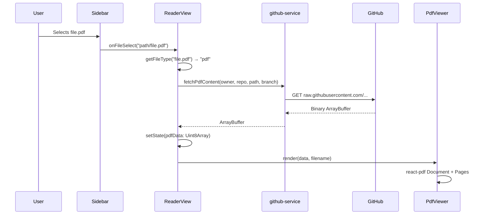

# Design Document: PDF Viewer

## Overview

This feature extends the ghmd-viewer application to support viewing PDF files from GitHub repositories alongside existing Markdown rendering. The design introduces a new `PdfViewer` React component powered by the `react-pdf` library (which wraps Mozilla's `pdfjs-dist`), extends the file discovery service to include PDF files, and adds file-type routing logic to the `ReaderView` to dynamically select the appropriate renderer.

The architecture follows the existing patterns: the `github-service.ts` gains a binary fetch function, the `Sidebar` learns about PDF file types, and a new `PdfViewer` component handles rendering, navigation, zoom, and accessibility.

### Key Design Decisions

1. **Library choice: `react-pdf`** — Provides React-friendly `Document` and `Page` components wrapping `pdfjs-dist`. It's the most widely used open-source React PDF renderer, actively maintained, and supports React 19. No custom canvas rendering needed.

2. **Binary data flow** — PDF content is fetched as `ArrayBuffer` (not text) and converted to a `Uint8Array` for `react-pdf`. This preserves binary integrity.

3. **File type routing in ReaderView** — The existing `ReaderView` gains a `getFileType()` utility function and conditionally renders either `MarkdownRenderer` or `PdfViewer` based on the selected file's extension. This keeps routing co-located with rendering state.

4. **Extend existing discovery rather than creating new service** — The `discoverMarkdownFiles` function is generalized to `discoverSupportedFiles` to include PDFs, reusing the same recursive traversal and depth limit.

## Architecture



### Data Flow



## Components and Interfaces

### New Components

#### `PdfViewer`

The main PDF rendering component.

```typescript
interface PdfViewerProps {
  /** PDF binary data as Uint8Array */
  data: Uint8Array
  /** Filename for accessibility labels and fallback download */
  filename: string
  /** Raw download URL for fallback link */
  downloadUrl: string
}
```

**Responsibilities:**
- Renders PDF pages vertically using `react-pdf`'s `Document` and `Page` components
- Manages current page tracking via scroll position (IntersectionObserver)
- Provides navigation controls (next/previous page)
- Provides zoom controls (25% increments, 50%–200%)
- Manages loading timeout (30 seconds)
- Displays error state with fallback download link
- Sets ARIA attributes for accessibility

#### `PdfNavControls`

Navigation toolbar displayed above the PDF content.

```typescript
interface PdfNavControlsProps {
  currentPage: number
  totalPages: number
  zoomLevel: number // percentage, 50–200
  onPreviousPage: () => void
  onNextPage: () => void
  onZoomIn: () => void
  onZoomOut: () => void
}
```

### Modified Components

#### `Sidebar` (modified)

- `FileTreeItem` gains file-type awareness: displays a document icon for `.pdf` files and the existing icon for `.md` files.
- The empty state message changes from "No Markdown files found" to "No supported files found".

#### `ReaderView` (modified)

- Adds `pdfData: Uint8Array | null` state alongside existing `content: string | null`
- Adds `fileType: 'markdown' | 'pdf' | 'unsupported'` derived from the selected file's extension
- Conditionally renders `PdfViewer` or `MarkdownRenderer` based on `fileType`
- Calls binary fetch for PDF files, text fetch for Markdown files

### New Service Functions

#### `github-service.ts` additions

```typescript
/** Check if a filename has a PDF extension (case-insensitive) */
export function isPdfFile(filename: string): boolean

/** Check if a filename is a supported viewable file */
export function isSupportedFile(filename: string): boolean

/** Fetch raw PDF binary content from a public repo */
export async function fetchPdfContent(
  owner: string,
  repo: string,
  path: string,
  branch: string,
  fetchFn?: typeof fetch
): Promise<ArrayBuffer>

/** Fetch raw PDF binary content from a private repo via backend proxy */
export async function fetchPrivatePdfContent(
  owner: string,
  repo: string,
  path: string,
  branch: string,
  backendUrl?: string | null,
  fetchFn?: typeof fetch
): Promise<ArrayBuffer>

/** Discover all supported files (MD + PDF) recursively */
export async function discoverSupportedFiles(
  owner: string,
  repo: string,
  path: string,
  branch: string,
  fetchContentsFn: (...) => Promise<GitHubContentItem[]>,
  maxDepth?: number
): Promise<FileTreeNode[]>
```

### Utility Functions

#### `file-type.ts` (new)

```typescript
export type SupportedFileType = 'markdown' | 'pdf' | 'unsupported'

/** Determine file type from filename extension */
export function getFileType(filename: string): SupportedFileType

/** Get the file extension (lowercase, without dot) */
export function getFileExtension(filename: string): string
```

## Data Models

### Extended `FileTreeNode`

The existing `FileTreeNode` type gains an optional `fileType` field for rendering purposes:

```typescript
export interface FileTreeNode {
  name: string
  path: string
  type: 'file' | 'directory'
  children?: FileTreeNode[]
  fileType?: 'markdown' | 'pdf'  // new: used by Sidebar for icon rendering
}
```

### PDF Viewer State

Internal state managed by the `PdfViewer` component:

```typescript
interface PdfViewerState {
  numPages: number | null       // Total pages (set after document loads)
  currentPage: number           // 1-indexed current page
  zoomLevel: number             // Percentage: 50, 75, 100, 125, 150, 175, 200
  error: string | null          // Render error message
  isLoaded: boolean             // Whether document has finished loading
}
```

### Zoom Level Constraints

```typescript
const ZOOM_MIN = 50
const ZOOM_MAX = 200
const ZOOM_STEP = 25
const ZOOM_DEFAULT = 100
```

### Loading Timeout

```typescript
const PDF_LOAD_TIMEOUT_MS = 30_000
```

## Correctness Properties

*A property is a characteristic or behavior that should hold true across all valid executions of a system — essentially, a formal statement about what the system should do. Properties serve as the bridge between human-readable specifications and machine-verifiable correctness guarantees.*

### Property 1: PDF file discovery inclusion

*For any* array of `GitHubContentItem` entries, every item whose filename ends with `.pdf` (case-insensitive comparison) SHALL appear in the discovered file tree, regardless of whether the containing directory also has Markdown files.

**Validates: Requirements 1.1, 1.3, 5.5**

### Property 2: File tree sorting invariant

*For any* `FileTreeNode[]` array returned by the discovery service at a given directory level, all nodes with `type === 'directory'` SHALL precede all nodes with `type === 'file'`, and within each group, nodes SHALL be sorted by `name` using locale-aware string comparison (`localeCompare`).

**Validates: Requirements 1.2**

### Property 3: File type routing correctness

*For any* filename string, `getFileType(filename)` SHALL return `'pdf'` if and only if the substring after the last `.` equals `'pdf'` (case-insensitive), `'markdown'` if and only if it equals `'md'` (case-insensitive), and `'unsupported'` otherwise. Furthermore, when `fileType` is `'pdf'`, the `ReaderView` SHALL render `PdfViewer` and not `MarkdownRenderer`, and vice versa.

**Validates: Requirements 5.1, 5.2, 5.3, 5.6**

### Property 4: PDF fetch URL construction

*For any* valid `owner`, `repo`, `branch`, and `path` strings, `fetchPdfContent` SHALL construct a request URL matching `https://raw.githubusercontent.com/{owner}/{repo}/{encodedBranch}/{path}`, and `fetchPrivatePdfContent` SHALL construct a request URL matching `{backendUrl}/api/proxy/raw/{encodedOwner}/{encodedRepo}/{path}?ref={encodedBranch}` with `credentials: 'include'`.

**Validates: Requirements 2.1, 2.2**

### Property 5: Navigation control disabled state

*For any* `currentPage` in range `[1, totalPages]` where `totalPages >= 1`: the "previous page" control SHALL be disabled (with `aria-disabled="true"`) if and only if `currentPage === 1`, and the "next page" control SHALL be disabled (with `aria-disabled="true"`) if and only if `currentPage === totalPages`.

**Validates: Requirements 4.3, 6.6**

### Property 6: Zoom level clamping

*For any* current zoom level in the valid range `[50, 200]`: invoking zoom-in SHALL produce `min(currentZoom + 25, 200)`, and invoking zoom-out SHALL produce `max(currentZoom - 25, 50)`. The zoom level SHALL always remain within `[50, 200]` after any number of zoom operations.

**Validates: Requirements 4.4**

### Property 7: Scroll position to current page mapping

*For any* set of N page elements with known positions and heights, and any scroll position, the computed `currentPage` SHALL be the 1-indexed page whose rendered area occupies the largest portion of the visible viewport.

**Validates: Requirements 4.5**

### Property 8: Page indicator format

*For any* `currentPage` in `[1, totalPages]` and `totalPages >= 1`, the displayed page indicator text SHALL match the format `"{currentPage} / {totalPages}"`.

**Validates: Requirements 4.1**

### Property 9: Error type preservation in mapping

*For any* error thrown during PDF content fetching, if the error is a `TypeError` with "fetch" in the message or has "network"/"timeout"/"abort" in the message, `mapErrorToAppError` SHALL return an `AppError` with `type: 'network'` and `retryable: true`.

**Validates: Requirements 2.4**

### Property 10: PDF viewer container accessibility

*For any* filename passed to `PdfViewer`, the outermost container element SHALL have `role="document"` and an `aria-label` attribute whose value contains the filename string.

**Validates: Requirements 6.1**

## Error Handling

### PDF Loading Errors

| Scenario | Behavior |
|----------|----------|
| Network error during fetch | `mapErrorToAppError` produces retryable network error; `ErrorDisplay` shown with retry button |
| 401 from backend proxy | `SessionExpiredError` thrown → auth_required AppError → re-authenticate prompt |
| 403 from backend proxy | `InstallationAccessError` thrown → auth_failed AppError → installation prompt |
| 404 (file not found) | not_found AppError → "File not found" message |
| Malformed PDF / zero pages | `PdfViewer` catches `react-pdf` load error → inline error with fallback download link |
| Load timeout (30s) | `PdfViewer` aborts via `AbortController` timeout → error state with fallback download link |

### Error State Recovery

- Network errors: Retry button re-triggers the fetch
- Auth errors: User is prompted to re-authenticate; on success, content reloads
- PDF render errors: Fallback download link allows the user to open the PDF externally
- File type errors: User can select a different (supported) file from the sidebar

## Testing Strategy

### Property-Based Tests (fast-check)

The project already has `fast-check` as a dev dependency. Property-based tests will be used for the pure logic functions where input space is large:

- **File type detection** (`getFileType`) — generate random filenames with various extensions and casings
- **File discovery filtering** (`isSupportedFile`, `isPdfFile`) — generate random `GitHubContentItem[]` arrays
- **File tree sorting** — generate random `FileTreeNode[]` arrays and verify ordering invariant
- **Zoom clamping** — generate random sequences of zoom-in/zoom-out operations and verify bounds
- **Navigation disabled state** — generate random (currentPage, totalPages) pairs
- **Page indicator format** — generate random valid page numbers and verify string format
- **URL construction** — generate random owner/repo/branch/path and verify URL pattern

Each property test runs a minimum of 100 iterations and is tagged with:
```
Feature: pdf-viewer, Property {N}: {title}
```

### Unit Tests (vitest)

Example-based tests for:
- `PdfViewer` renders without triggering downloads (JSDOM limitations may require mocking react-pdf)
- Sidebar displays correct icon for PDF vs Markdown files
- Empty state message when no supported files exist
- 401/403 error responses throw correct custom errors
- ArrayBuffer response handling in fetch functions
- Keyboard accessibility of navigation controls (Tab, Enter, Space)
- ARIA live region updates on page change
- Fallback download link presence on render error

### Integration Tests

- End-to-end file selection → fetch → render flow using mocked fetch responses
- Sidebar discovery of mixed PDF/Markdown repositories
- File switching between PDF and Markdown files clears previous content

### Library Dependencies

New runtime dependency:
- `react-pdf` — React components for PDF rendering (wraps `pdfjs-dist`)

The `pdfjs-dist` worker file must be configured. `react-pdf` supports Vite via its built-in worker loader or by setting the worker source URL.
