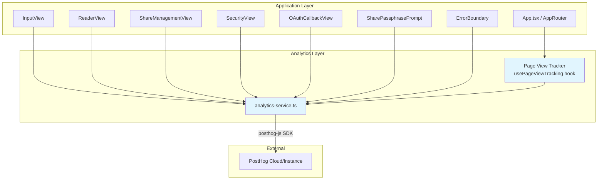

# Design Document: PostHog Event Analytics

## Overview

This design describes the integration of PostHog event analytics into the ghmd-viewer React/TypeScript frontend. The system adds a thin analytics service layer (`src/services/analytics-service.ts`) that wraps the `posthog-js` SDK, exposes typed event capture methods, and integrates with existing views, hooks, and services via direct function calls.

The design prioritizes:
- **Non-intrusiveness**: Analytics failures never interrupt user workflows.
- **Privacy-first**: No PII is captured; Do Not Track is respected.
- **Graceful degradation**: When PostHog is unconfigured or disabled, all analytics calls become no-ops.
- **Testability**: The analytics service is a plain module (no React context) with injectable dependencies for unit and property-based testing.

## Architecture



### Key Architectural Decisions

1. **Module-based service (not React Context)**: The analytics service is a singleton module with exported functions. This avoids unnecessary re-renders and allows non-component code (services, error handlers) to call analytics directly.

2. **Hook for page view tracking**: A `usePageViewTracking` hook uses the existing `useHashRouter` hook output to detect route changes and fire `page_viewed` events with deduplication logic.

3. **posthog-js as the sole SDK dependency**: The official `posthog-js` package handles batching, retry, persistence, and transport. We do not implement custom network logic.

4. **SHA-256 hashing for user identity**: We use the Web Crypto API (`crypto.subtle.digest`) to hash GitHub user IDs before passing them to `posthog.identify()`, ensuring no raw user identifiers leave the browser.

## Components and Interfaces

### 1. `src/services/analytics-service.ts`

The core module responsible for initialization and event capture.

```typescript
// Public API
export interface AnalyticsService {
  /** Initialize PostHog. Called once at app startup. */
  init(): void;

  /** Track a named event with optional properties. */
  capture(eventName: string, properties?: Record<string, string | number | boolean>): void;

  /** Identify the user with a hashed ID. */
  identify(hashedUserId: string): void;

  /** Reset identity (on logout). */
  reset(): void;

  /** Check if analytics is active (initialized and not disabled). */
  isActive(): boolean;
}

// Factory function
export function createAnalyticsService(config?: AnalyticsConfig): AnalyticsService;

export interface AnalyticsConfig {
  posthogKey?: string;
  posthogHost?: string;
  sessionRecording?: string;
  doNotTrack?: string;
}
```

**Initialization logic:**
1. Read `VITE_POSTHOG_KEY` and `VITE_POSTHOG_HOST` from `import.meta.env`.
2. If either is missing/empty, return a no-op service instance.
3. Check `navigator.doNotTrack` — if `"1"`, return a no-op service instance.
4. Call `posthog.init()` with:
   - `api_host`: value of `VITE_POSTHOG_HOST`
   - `capture_pageview`: `false`
   - `capture_pageleave`: `true`
   - `persistence`: `"localStorage+cookie"`
   - `disable_session_recording`: `!(VITE_POSTHOG_SESSION_RECORDING === "true")`

**No-op service:**
```typescript
const noopService: AnalyticsService = {
  init: () => {},
  capture: () => {},
  identify: () => {},
  reset: () => {},
  isActive: () => false,
};
```

### 2. `src/hooks/usePageViewTracking.ts`

A React hook that tracks page views on route changes with deduplication.

```typescript
export function usePageViewTracking(route: Route): void;
```

**Behavior:**
- Maintains a ref to the previous route signature (type + key parameters).
- On each render where the route signature differs from the previous, calls `analytics.capture('page_viewed', { page, ...routeParams })`.
- Uses `useEffect` with the route signature as dependency to fire exactly once per navigation.

**Route-to-page mapping:**
| Route type | `page` property | Additional properties |
|---|---|---|
| `input` | `"input"` | — |
| `reader` | `"reader"` | `owner`, `repo`, `branch` |
| `shares` | `"share_management"` | — |
| `security` | `"security"` | — |
| `oauth-callback` | `"oauth_callback"` | — |
| `share` | `"share_redeem"` | — |

### 3. `src/lib/analytics-hash.ts`

Utility for SHA-256 hashing of user identifiers.

```typescript
export async function hashUserId(githubUserId: string): Promise<string>;
```

Uses `crypto.subtle.digest('SHA-256', ...)` and returns a hex-encoded string.

### 4. Integration Points

| Location | Event | Trigger |
|---|---|---|
| `App.tsx` (AppRouter) | `usePageViewTracking(route)` | Route changes |
| `InputView.tsx` | `repo_opened` | Form submission navigating to ReaderView |
| `ReaderView.tsx` | `file_viewed`, `error_occurred` | File selection, content fetch error |
| Sidebar component | `directory_expanded` | Directory node expansion |
| `MarkdownRenderer.tsx` | `link_navigated` | Internal markdown link click |
| `OAuthCallbackView.tsx` | `login_started`, `login_completed`, `login_failed` | OAuth flow stages |
| `PatLoginForm.tsx` | `login_started`, `login_completed`, `login_failed` | PAT flow stages |
| Auth service callers | `logged_out` | Logout action |
| Share creation flow | `share_link_created`, `share_link_failed` | Create success/failure |
| Share copy action | `share_link_copied` | Clipboard copy |
| `SharePassphrasePrompt.tsx` | `share_link_redeemed`, `share_link_redeem_failed` | Redeem success/failure |
| `ShareManagementView.tsx` | `share_link_revoked` | Revoke action |
| `ErrorBoundary.tsx` | `error_occurred` | Unhandled React error |
| Sidebar discovery | `error_occurred` | Directory fetch failure |

## Data Models

### Event Schema

All events are sent to PostHog with a flat property map. Below are the event types and their property shapes.

```typescript
// Page views
type PageViewedEvent = {
  event: 'page_viewed';
  properties: {
    page: 'input' | 'reader' | 'share_management' | 'security' | 'oauth_callback' | 'share_redeem';
    owner?: string;   // only for 'reader'
    repo?: string;    // only for 'reader'
    branch?: string;  // only for 'reader'
  };
};

// Authentication
type LoginStartedEvent = { event: 'login_started'; properties: { method: 'oauth' | 'pat' } };
type LoginCompletedEvent = { event: 'login_completed'; properties: { method: 'oauth' | 'pat' } };
type LoginFailedEvent = {
  event: 'login_failed';
  properties: {
    method: 'oauth' | 'pat';
    error_type: 'state_mismatch' | 'exchange_failed' | 'cancelled' | 'pat_login_failed';
  };
};
type LoggedOutEvent = { event: 'logged_out'; properties: { method: 'oauth' | 'pat' } };

// Repository browsing
type RepoOpenedEvent = {
  event: 'repo_opened';
  properties: { owner: string; repo: string; branch: string; is_private: boolean };
};
type FileViewedEvent = {
  event: 'file_viewed';
  properties: { file_type: 'markdown' | 'pdf'; file_path: string; repo: string };
};
type DirectoryExpandedEvent = {
  event: 'directory_expanded';
  properties: { directory_path: string; repo: string };
};
type LinkNavigatedEvent = {
  event: 'link_navigated';
  properties: { target_path: string; repo: string };
};

// Share links
type ShareLinkCreatedEvent = {
  event: 'share_link_created';
  properties: { expires_in_hours: number; auth_method: 'oauth' | 'pat' };
};
type ShareLinkCopiedEvent = { event: 'share_link_copied'; properties: Record<string, never> };
type ShareLinkRedeemedEvent = { event: 'share_link_redeemed'; properties: Record<string, never> };
type ShareLinkFailedEvent = {
  event: 'share_link_failed';
  properties: {
    error_type: 'auth_required' | 'session_expired' | 'validation_error' | 'server_error' | 'encryption_error';
  };
};
type ShareLinkRevokedEvent = { event: 'share_link_revoked'; properties: Record<string, never> };
type ShareLinkRedeemFailedEvent = {
  event: 'share_link_redeem_failed';
  properties: { error_type: 'expired' | 'invalid_passphrase' | 'invalid_token' | 'rate_limited' };
};

// Errors
type ErrorOccurredEvent = {
  event: 'error_occurred';
  properties: {
    error_type: string;
    context?: 'content_fetch' | 'sidebar_discovery';
    component?: 'ErrorBoundary';
    message: string; // truncated to 256 chars
  };
};
```

### Configuration Model

```typescript
interface PostHogInitConfig {
  api_host: string;
  capture_pageview: false;
  capture_pageleave: true;
  persistence: 'localStorage+cookie';
  disable_session_recording: boolean;
}
```

## Correctness Properties

*A property is a characteristic or behavior that should hold true across all valid executions of a system — essentially, a formal statement about what the system should do. Properties serve as the bridge between human-readable specifications and machine-verifiable correctness guarantees.*

### Property 1: No-op stub safety

*For any* event name, property map, or identity string, when the analytics service is disabled (missing API key, missing host, or DNT enabled), calling `capture()`, `identify()`, or `reset()` SHALL execute without throwing an exception and SHALL produce no network requests.

**Validates: Requirements 1.4, 1.5, 7.3, 7.4**

### Property 2: Session recording disabled for non-"true" values

*For any* string value of `VITE_POSTHOG_SESSION_RECORDING` that is not exactly `"true"` (including empty string, undefined, `"True"`, `"TRUE"`, `"false"`, or any random string), session recording SHALL be disabled in the PostHog configuration.

**Validates: Requirements 1.8**

### Property 3: Page view deduplication

*For any* route, if the hash changes but resolves to the same route type and same route parameters as the currently tracked route, the analytics service SHALL NOT emit an additional `page_viewed` event. Exactly one `page_viewed` event is captured per distinct route navigation.

**Validates: Requirements 2.7, 2.8**

### Property 4: Reader page view captures route parameters

*For any* valid owner, repo, and branch strings, when navigation to a reader route occurs, the captured `page_viewed` event SHALL contain properties `page: "reader"`, `owner` matching the route's owner segment, `repo` matching the route's repo segment, and `branch` matching the route's branch segment.

**Validates: Requirements 2.2**

### Property 5: Auth failure event correctness

*For any* combination of authentication method (`"oauth"` | `"pat"`) and error type from the set `{"state_mismatch", "exchange_failed", "cancelled", "pat_login_failed"}`, a `login_failed` event SHALL be captured with the `method` and `error_type` properties matching the failure context exactly.

**Validates: Requirements 3.5**

### Property 6: User identity is SHA-256 hashed

*For any* GitHub user ID string, calling `identify` SHALL invoke `posthog.identify()` with the hex-encoded SHA-256 hash of that string, never the raw user ID.

**Validates: Requirements 3.7**

### Property 7: Event capture resilience

*For any* event capture call that triggers an internal error (PostHog SDK throws, network unreachable, etc.), the error SHALL NOT propagate to the calling code. The caller receives no exception and the application flow continues uninterrupted.

**Validates: Requirements 3.8, 4.5, 6.4**

### Property 8: Browsing event property fidelity

*For any* repository browsing action (repo opened, file viewed, directory expanded, link navigated) with arbitrary valid property values, the captured event SHALL contain all specified properties with values exactly matching the triggering action's data.

**Validates: Requirements 4.1, 4.2, 4.3, 4.4**

### Property 9: Share event error type correctness

*For any* share link failure error type from the set `{"auth_required", "session_expired", "validation_error", "server_error", "encryption_error"}` or redemption failure error type from the set `{"expired", "invalid_passphrase", "invalid_token", "rate_limited"}`, the captured failure event SHALL include the `error_type` property matching the actual error exactly.

**Validates: Requirements 5.4, 5.6**

### Property 10: Error event message truncation

*For any* error message string of arbitrary length, the `message` property in a captured `error_occurred` event SHALL be at most 256 characters. If the original message exceeds 256 characters, it SHALL be truncated to exactly 256 characters.

**Validates: Requirements 6.2**

### Property 11: No PII in event properties

*For any* captured event, the property values SHALL NOT contain strings matching email address patterns, GitHub Personal Access Token patterns (`ghp_*`, `github_pat_*`), or raw GitHub usernames that were provided as input to the analytics service.

**Validates: Requirements 7.1, 7.2**

## Error Handling

### Strategy: Silent Failure

All analytics operations are wrapped in try/catch at the service boundary. Errors are logged to `console.warn` in development mode but never propagated to callers.

```typescript
capture(eventName: string, properties?: Record<string, unknown>): void {
  try {
    posthog.capture(eventName, properties);
  } catch (error) {
    if (import.meta.env.DEV) {
      console.warn('[Analytics] Capture failed:', eventName, error);
    }
    // Silent discard — never throw
  }
}
```

### Specific Error Scenarios

| Scenario | Handling |
|---|---|
| PostHog SDK init fails | Service falls back to no-op mode. App continues. |
| Network unreachable | PostHog SDK handles retry/queue internally. No app impact. |
| `crypto.subtle` unavailable (non-HTTPS) | `hashUserId` falls back to a simple non-cryptographic hash. Identity still pseudonymous. |
| Invalid event properties (wrong types) | TypeScript compile-time checks prevent this. Runtime: PostHog accepts any JSON-serializable value. |
| PostHog rate-limits the client | SDK handles backoff internally. No app impact. |

### Graceful Degradation Hierarchy

1. **Fully functional**: API key + host configured, DNT not set → full analytics.
2. **No session recording**: `VITE_POSTHOG_SESSION_RECORDING` ≠ `"true"` → events captured, no recordings.
3. **Fully disabled**: Missing config OR DNT=1 → all calls are no-ops, zero network requests.

## Testing Strategy

### Unit Tests (Vitest + Testing Library)

Unit tests cover specific examples, integration points, and configuration edge cases:

- PostHog init is called with correct config values (smoke)
- Each view navigation emits the correct `page_viewed` event name and page property
- OAuth and PAT login flows emit correct start/complete/fail events
- Share link events emit with correct properties
- ErrorBoundary integration triggers `error_occurred` with truncated message
- `hashUserId` produces correct SHA-256 hex output for known inputs
- `isActive()` returns false when disabled

### Property-Based Tests (Vitest + fast-check)

Property-based tests verify universal correctness guarantees using the `fast-check` library (already a devDependency):

- **Library**: `fast-check` (v4.9.0, already installed)
- **Runner**: `vitest --run`
- **Minimum iterations**: 100 per property
- **Tag format**: `Feature: posthog-event-analytics, Property {N}: {title}`

Each correctness property from the design maps to a single property-based test:

| Property | Test approach |
|---|---|
| P1: No-op stub safety | Generate random event names + property maps, call all methods on disabled service, assert no throws and mock PostHog never called |
| P2: Session recording config | Generate random non-"true" strings via `fc.string()` filtered, verify `disable_session_recording: true` |
| P3: Page view deduplication | Generate random routes, call tracking twice with same route, assert single capture call |
| P4: Reader route params | Generate random `{owner, repo, branch}` via `fc.record`, verify captured properties match |
| P5: Auth failure correctness | Generate from `fc.oneof` of method × error_type, verify event properties |
| P6: Identity hashing | Generate random user ID strings, verify identify called with SHA-256 hash |
| P7: Capture resilience | Generate random events, mock PostHog to throw, verify no exception escapes |
| P8: Browsing event fidelity | Generate random file paths + repo names, verify captured properties match input |
| P9: Share error types | Generate from error type enums, verify property match |
| P10: Message truncation | Generate `fc.string({ minLength: 0, maxLength: 1000 })`, verify output ≤ 256 chars |
| P11: No PII leakage | Generate events with PII-like inputs, verify captured properties are sanitized |

### Integration Tests

- End-to-end test verifying PostHog receives events when running against a local PostHog instance (optional, CI-only)
- Timing assertion: events dispatched within 1 second of trigger (Requirement 4.6)

### Test File Structure

```
src/services/__tests__/
  analytics-service.test.ts        # Unit tests
  analytics-service.property.test.ts  # Property-based tests
src/hooks/__tests__/
  usePageViewTracking.test.ts      # Hook unit tests
src/lib/__tests__/
  analytics-hash.test.ts           # Hash utility tests
  analytics-hash.property.test.ts  # Hash property tests
```
