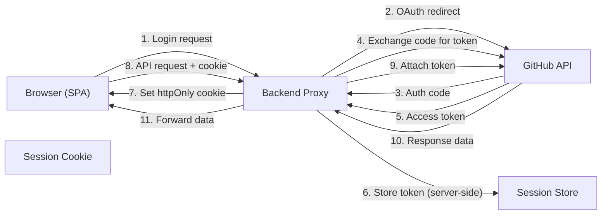

# Design Document

## Overview

This feature adds a `/security` hash route to the GitHub Markdown Viewer that renders a static `SECURITY.md` file from the `public/` folder. The page displays security documentation — including authentication flows, security measures, and a Mermaid Data Flow Diagram — using the existing `MarkdownRenderer` and `MermaidDiagramRenderer` components. No backend changes are required.

## Architecture

The feature follows the existing route-based architecture:

1. The `parseHash` function in `url-state.ts` gains a new `security` route type
2. The `AppRouter` in `App.tsx` maps the `security` route type to a `SecurityView` component
3. `SecurityView` fetches `SECURITY.md` from the `public/` folder at runtime and renders it using `MarkdownRenderer`

```
Hash change (#/security)
  → useHashRouter() calls parseHash()
  → Returns { type: 'security' }
  → AppRouter renders <SecurityView />
  → SecurityView fetches /SECURITY.md
  → MarkdownRenderer renders content (mermaidEnabled=true)
  → MermaidDiagramRenderer renders the DFD as SVG
```

## Components and Interfaces

### 1. Route Type Extension (`src/services/url-state.ts`)

Add a `security` variant to the `Route` union type and handle it in `parseHash`.

```typescript
export type Route =
  | { type: 'input' }
  | { type: 'reader'; state: HashState }
  | { type: 'oauth-callback'; params: URLSearchParams }
  | { type: 'share'; payload: string }
  | { type: 'security' }
```

The `parseHash` function gains a check for `/security` before falling through to the reader route logic:

```typescript
// Security page: #/security
if (raw === '/security') {
  return { type: 'security' }
}
```

### 2. AppRouter Update (`src/App.tsx`)

Add a `case 'security'` branch to the route switch:

```typescript
import { SecurityView } from '@/views/SecurityView'

function AppRouter() {
  const route = useHashRouter()

  switch (route.type) {
    case 'input':
      return <InputView />
    case 'reader':
      return <ReaderView state={route.state} />
    case 'oauth-callback':
      return <OAuthCallbackView params={route.params} />
    case 'share':
      return <SharePassphrasePrompt payload={route.payload} />
    case 'security':
      return <SecurityView />
  }
}
```

### 3. SecurityView Component (`src/views/SecurityView.tsx`)

A new view component that fetches and renders the security documentation.

```typescript
import { useEffect, useState } from 'react'
import { MarkdownRenderer } from '@/components/MarkdownRenderer'
import { Header } from '@/components/Header'

type LoadState =
  | { status: 'loading' }
  | { status: 'success'; content: string }
  | { status: 'error'; message: string }

export function SecurityView() {
  const [state, setState] = useState<LoadState>({ status: 'loading' })

  useEffect(() => {
    fetch('/SECURITY.md')
      .then((res) => {
        if (!res.ok) throw new Error(`Failed to load security documentation (${res.status})`)
        return res.text()
      })
      .then((content) => setState({ status: 'success', content }))
      .catch((err) => setState({ status: 'error', message: err.message }))
  }, [])

  return (
    <div className="min-h-screen">
      <Header />
      <main className="max-w-4xl mx-auto px-4 py-8">
        <h1 className="text-3xl font-semibold tracking-tight mb-6">Security</h1>
        {state.status === 'loading' && (
          <p className="text-muted-foreground">Loading security documentation...</p>
        )}
        {state.status === 'error' && (
          <p className="text-destructive" role="alert">{state.message}</p>
        )}
        {state.status === 'success' && (
          <MarkdownRenderer
            content={state.content}
            basePath=""
            owner=""
            repo=""
            branch=""
            isPrivate={false}
            mermaidEnabled={true}
            onNavigate={() => {}}
          />
        )}
      </main>
    </div>
  )
}
```

### 4. SECURITY.md Content File (`public/SECURITY.md`)

A static Markdown file placed in the Vite `public/` directory. It is served as-is at the root URL `/SECURITY.md`. The content includes:

- An overview of the authentication architecture
- Documentation of the OAuth flow (redirect → code exchange → session)
- Documentation of the PAT flow (token validation → session)
- Explanation that tokens are stored server-side only
- Explanation of the backend proxy token forwarding pattern
- Security measures: httpOnly/Secure/SameSite cookies, SHA-256 hashed session IDs, CORS, CSRF headers, rate limiting
- A Mermaid flowchart DFD (≤ 10 nodes) showing data flow between Browser, Backend, and GitHub API

### 5. Interfaces

#### Route Type

```typescript
// Extended Route union (url-state.ts)
export type Route =
  | { type: 'input' }
  | { type: 'reader'; state: HashState }
  | { type: 'oauth-callback'; params: URLSearchParams }
  | { type: 'share'; payload: string }
  | { type: 'security' }
```

#### SecurityView Props

`SecurityView` takes no props. It is a self-contained view that manages its own data fetching.

#### MarkdownRenderer Usage

The `SecurityView` passes these props to `MarkdownRenderer`:

| Prop | Value | Reason |
|------|-------|--------|
| `content` | fetched SECURITY.md text | The markdown to render |
| `basePath` | `""` | No relative links to resolve |
| `owner` | `""` | Not within a repo context |
| `repo` | `""` | Not within a repo context |
| `branch` | `""` | Not within a repo context |
| `isPrivate` | `false` | Public content, no auth needed for images |
| `mermaidEnabled` | `true` | Enable DFD rendering |
| `onNavigate` | no-op `() => {}` | No in-app markdown navigation needed |

## Data Models

No new data models are introduced. The `Route` type gains one additional variant (`{ type: 'security' }`) with no associated data payload.

## Error Handling

| Scenario | Behavior |
|----------|----------|
| Network error fetching SECURITY.md | Display error message in the view with `role="alert"` |
| HTTP error (404, 500) from SECURITY.md fetch | Display error message with status code |
| Mermaid rendering failure | Handled by existing `MermaidDiagramRenderer` — shows error + raw source |
| Invalid hash after `/security` (e.g., `#/security/foo`) | Falls through to reader route parsing, which requires 4+ segments, so returns `{ type: 'input' }` |

## Data Flow Diagram (Mermaid Content)

The DFD embedded in SECURITY.md will use this structure (≤ 10 nodes):



This diagram has 5 nodes and depicts:
- Tokens flow Backend → GitHub only (never to Browser)
- Browser ↔ Backend communication uses session cookies
- Token storage is server-side only

## Testing Strategy

- **Unit tests**: Verify `parseHash` handles the `#/security` route correctly and doesn't regress existing routes. Verify SECURITY.md content sections exist and contain expected headings.
- **Property tests**: Verify SECURITY.md content does not leak internal implementation details across all lines (Property 1). Verify parseHash determinism for any input (Property 2).
- **Integration tests**: Render `SecurityView` and confirm MarkdownRenderer + MermaidDiagramRenderer pipeline works end-to-end with the static content.

## Correctness Properties

*A property is a characteristic or behavior that should hold true across all valid executions of a system — essentially, a formal statement about what the system should do. Properties serve as the bridge between human-readable specifications and machine-verifiable correctness guarantees.*

### Property 1: Security route parsing is exact-match only

*For any* hash string that starts with `/security` but is not exactly `/security` (e.g., `/securityx`, `/security/foo`), `parseHash` SHALL NOT return a route of type `security`.

**Validates: Requirements 1.1**

### Property 2: Existing routes are unaffected by security route addition

*For any* hash string that previously parsed to a valid route type (`input`, `reader`, `oauth-callback`, or `share`), the addition of the `security` route SHALL NOT change the parsed result.

**Validates: Requirements 1.1**

### Property 3: Security content contains no internal implementation details

*For any* line in the SECURITY.md content, the line SHALL NOT contain patterns that expose internal implementation details, including: server-side file paths (patterns like `/src/`, `/routes/`, `__DIR__`, `.php`), specific encryption algorithm identifiers (e.g., `aes-256-gcm`), session storage file patterns (e.g., `sess_*.json`), encryption key format specs (e.g., `hex-encoded 32-byte`), or internal API route paths (e.g., `/api/auth/callback`).

**Validates: Requirements 4.1, 4.2**

### Property 4: Data Flow Diagram node count is bounded

*For any* valid rendering of the SECURITY.md Mermaid diagram, the total number of distinct nodes SHALL be no more than 10, ensuring the diagram remains minimal and high-level.

**Validates: Requirements 3.5**
