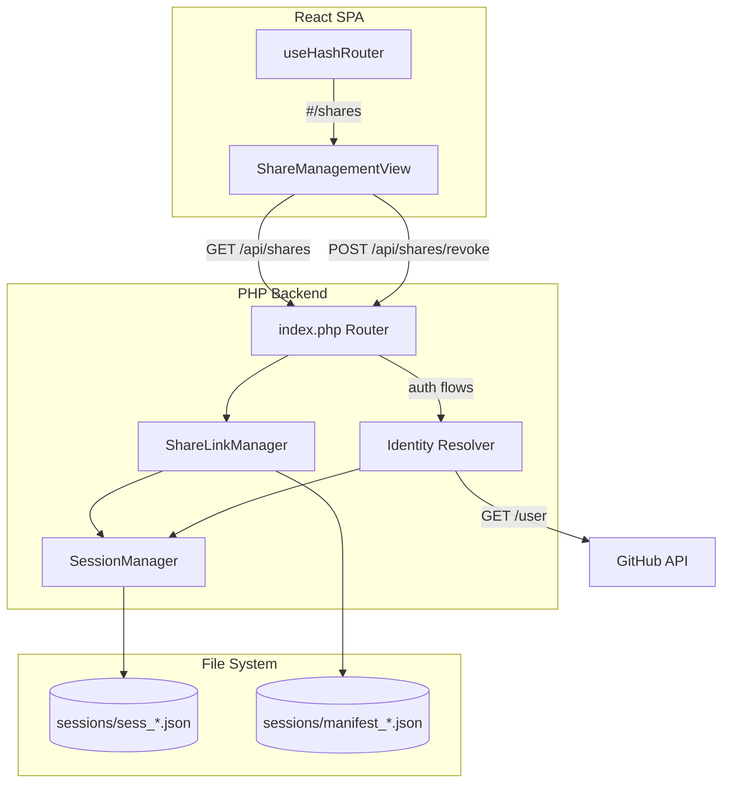

# Technical Design Document: Share Link Management

## Overview

This feature adds a complete share link management lifecycle to the GitHub Markdown Viewer. Currently, share links are created via `POST /api/share/create` but become untrackable after creation. This design introduces:

1. **Identity Resolution** — resolving the GitHub numeric user ID during OAuth and PAT authentication to serve as a stable, session-independent key for user data.
2. **Share Manifest** — a per-user encrypted file that indexes all share links created by that user, persisting across login/logout cycles.
3. **Management API** — `GET /api/shares` and `POST /api/shares/revoke` endpoints to list and revoke share links.
4. **Frontend View** — a React view at `#/shares` for authenticated users to browse and revoke their share links.
5. **Automatic Cleanup** — orphaned manifest entries are pruned on read when the corresponding scoped session file no longer exists.

The design leverages the existing file-based session architecture and AES-256-GCM encryption scheme already used by `SessionManager`.

## Architecture



### Key Design Decisions

1. **GitHub User ID as identity key**: The numeric `id` from GitHub's `/user` endpoint is immutable and unique. Using it as the manifest key ensures share links persist across session regeneration, logout/login, and PAT-to-OAuth switching.

2. **Manifest stored alongside sessions**: Manifest files live in `backend/sessions/` with the naming pattern `manifest_{sha256(github_user_id)}.json`. This keeps all encrypted user data in one directory with consistent permissions.

3. **Lazy cleanup on read**: Rather than a separate cleanup job, expired/orphaned entries are purged when the manifest is read. This avoids background processes and aligns with the existing probabilistic cleanup pattern in `SessionManager`.

4. **Token hash as share identifier**: The SHA-256 hash of the scoped session token serves as the share entry key. This allows identifying entries without exposing the raw token, and matches how session files are named on disk.

## Components and Interfaces

### Backend Components

#### 1. Identity Resolver (integrated into auth routes)

Not a standalone class — identity resolution is added directly to `auth_callback.php` and `auth_pat_login.php` since both already call GitHub's API.

```php
/**
 * Fetches the GitHub user ID from the /user endpoint.
 * Returns the numeric ID or null on failure.
 */
function resolveGitHubUserId(string $accessToken): ?int
```

**Behavior:**
- Called during OAuth callback (after token exchange) and PAT login (after validation)
- Makes `GET https://api.github.com/user` with the user's token
- Extracts the `id` field from the response
- On failure (network error, invalid response), returns `null`
- The session is still created on failure; `github_user_id` is simply omitted

#### 2. ShareLinkManager (new class)

```php
namespace GhmdViewer;

class ShareLinkManager
{
    public function __construct(SessionManager $sessionManager, ?string $sessionsDir = null);

    /** Record a new share entry in the user's manifest */
    public function recordShare(int $githubUserId, array $shareEntry): void;

    /** List all share entries for a user (with status computation and cleanup) */
    public function listShares(int $githubUserId): array;

    /** Revoke a share by token hash — deletes session file and removes manifest entry */
    public function revokeShare(int $githubUserId, string $tokenHash): bool;

    /** Get the manifest path for a user */
    private function getManifestPath(int $githubUserId): string;

    /** Read and decrypt the manifest, performing orphan cleanup */
    private function readManifest(int $githubUserId): array;

    /** Encrypt and write the manifest to disk */
    private function writeManifest(int $githubUserId, array $entries): void;
}
```

#### 3. New API Routes

| Method | Path | Handler File | Description |
|--------|------|-------------|-------------|
| GET | `/api/shares` | `share_list.php` | List user's share entries |
| POST | `/api/shares/revoke` | `share_revoke.php` | Revoke a specific share link |

#### 4. Modified Files

| File | Change |
|------|--------|
| `backend/public/index.php` | Add routes for `GET /api/shares` and `POST /api/shares/revoke` |
| `backend/src/routes/auth_callback.php` | Add `resolveGitHubUserId()` call after token exchange, store in session |
| `backend/src/routes/auth_pat_login.php` | Add `resolveGitHubUserId()` call after validation, store in session |
| `backend/src/routes/share_create.php` | Add call to `ShareLinkManager::recordShare()` after creating scoped session |

### Frontend Components

#### 1. ShareManagementView (new view)

```typescript
// src/views/ShareManagementView.tsx
export function ShareManagementView(): JSX.Element
```

**Responsibilities:**
- Fetches share list from `GET /api/shares` on mount
- Renders a table/list of share entries with scope, dates, status, auth method
- Provides a revoke button per entry that calls `POST /api/shares/revoke`
- Shows empty state message when no shares exist
- Redirects to input view if not authenticated (401 response)

#### 2. Route Changes

```typescript
// Updated Route type in src/services/url-state.ts
export type Route =
  | { type: 'input' }
  | { type: 'reader'; state: HashState }
  | { type: 'oauth-callback'; params: URLSearchParams }
  | { type: 'share'; payload: string }
  | { type: 'security' }
  | { type: 'shares' }  // NEW
```

#### 3. API Service Functions

```typescript
// src/services/share-api.ts
export interface ShareEntry {
  token_hash: string;
  scope: { owner: string; repo: string; branch: string; path: string };
  created_at: number;
  expires_at: number;
  auth_method: 'oauth' | 'pat';
  status: 'active' | 'expired';
}

export async function fetchShares(): Promise<ShareEntry[]>;
export async function revokeShare(tokenHash: string): Promise<void>;
```

## Data Models

### Session Data (updated)

```json
{
  "installation_token": "ghu_xxxx...",
  "auth_method": "oauth",
  "created_at": 1700000000,
  "expires_at": 1700086400,
  "refresh_token": "ghr_xxxx...",
  "token_expires_at": 1700028800,
  "github_user_id": 12345678
}
```

The `github_user_id` field is added to session data during authentication. It is nullable — if identity resolution fails, this field is absent and share management endpoints return 503.

### Share Manifest File

**Location:** `backend/sessions/manifest_{sha256(string(github_user_id))}.json`

**Format:** Encrypted with AES-256-GCM (same as session files), decrypts to:

```json
{
  "entries": {
    "a1b2c3d4...": {
      "token_hash": "a1b2c3d4...",
      "scope": {
        "owner": "octocat",
        "repo": "hello-world",
        "branch": "main",
        "path": "docs"
      },
      "created_at": 1700000000,
      "expires_at": 1700036000,
      "auth_method": "oauth"
    }
  }
}
```

The `token_hash` is the SHA-256 hash of the scoped session token, which also determines the session filename (`sess_{token_hash}.json`). This creates a direct link between a manifest entry and its corresponding session file on disk.

### Share Entry Status Computation

Status is computed at read time, not stored:
- `"active"`: `expires_at >= now` AND session file exists on disk
- `"expired"`: `expires_at < now` OR session file does not exist on disk

### API Response Schemas

**GET /api/shares — 200 OK:**
```json
[
  {
    "token_hash": "a1b2c3d4...",
    "scope": { "owner": "octocat", "repo": "hello-world", "branch": "main", "path": "docs" },
    "created_at": 1700000000,
    "expires_at": 1700036000,
    "auth_method": "oauth",
    "status": "active"
  }
]
```

**POST /api/shares/revoke — Request:**
```json
{ "token_hash": "a1b2c3d4..." }
```

**POST /api/shares/revoke — 200 OK:**
```json
{ "revoked": true }
```


## Correctness Properties

*A property is a characteristic or behavior that should hold true across all valid executions of a system—essentially, a formal statement about what the system should do. Properties serve as the bridge between human-readable specifications and machine-verifiable correctness guarantees.*

### Property 1: Manifest path determinism

*For any* GitHub user ID, the computed manifest file path SHALL always be `manifest_{sha256(string(github_user_id))}.json` within the sessions directory, and the same user ID SHALL always produce the same path.

**Validates: Requirements 1.6**

### Property 2: Record-then-list round trip

*For any* valid share creation (with valid scope owner, repo, branch, path and valid expiration), recording the share entry and then listing shares for the same user SHALL return a list that contains the newly recorded entry with matching scope, timestamps, and auth_method.

**Validates: Requirements 2.1, 3.1**

### Property 3: Manifest encryption round trip

*For any* valid manifest data structure (a map of share entries), encrypting it with AES-256-GCM and then decrypting SHALL produce an identical data structure.

**Validates: Requirements 2.4**

### Property 4: Status computation correctness

*For any* share entry, if `expires_at < now` then the computed status SHALL be `"expired"`, and if `expires_at >= now` and the corresponding session file exists on disk then the computed status SHALL be `"active"`.

**Validates: Requirements 3.3**

### Property 5: Revocation completeness

*For any* share entry that exists in the user's manifest, revoking it by token_hash SHALL result in both: (a) the corresponding scoped session file no longer existing on disk, and (b) the manifest no longer containing that token_hash entry.

**Validates: Requirements 4.1, 4.2**

### Property 6: Scoped session rejection

*For any* session that contains a `scope` field (indicating it is a Scoped_Session), attempts to list or revoke shares SHALL be rejected with HTTP 403.

**Validates: Requirements 6.3**

### Property 7: User isolation

*For any* two distinct GitHub user IDs with separate manifests, listing shares for user A SHALL never return entries from user B's manifest, and revoking a share for user A SHALL never affect user B's manifest.

**Validates: Requirements 6.4**

### Property 8: Orphan cleanup on read

*For any* manifest containing entries where the corresponding scoped session file no longer exists on disk, reading the manifest SHALL remove those orphaned entries and persist the cleaned manifest.

**Validates: Requirements 7.1, 7.2**

### Property 9: Empty manifest deletion

*For any* manifest where all entries have been removed (either by revocation or orphan cleanup), the manifest file itself SHALL be deleted from disk.

**Validates: Requirements 7.3**

### Property 10: List response completeness

*For any* share entry returned by the list endpoint, the response object SHALL contain all of: token_hash, scope (with owner, repo, branch, path), created_at, expires_at, auth_method, and status fields.

**Validates: Requirements 3.2**

## Error Handling

### Backend Error Scenarios

| Scenario | HTTP Code | Response | Recovery |
|----------|-----------|----------|----------|
| No session cookie | 401 | `{"error": "Authentication required"}` | Frontend redirects to input view |
| Invalid/expired session | 401 | `{"error": "Session invalid or expired"}` | Frontend redirects to input view |
| Scoped session attempts management | 403 | `{"error": "Share management requires a full session"}` | N/A — scoped sessions can't manage shares |
| Missing github_user_id in session | 503 | `{"error": "Share management temporarily unavailable"}` | User can retry after re-login |
| Token hash not found in manifest | 404 | `{"error": "Share link not found"}` | Frontend removes entry from UI |
| Missing CSRF header on POST | 403 | `{"error": "Forbidden: missing CSRF header"}` | N/A — existing global protection |
| Manifest file corruption/decrypt failure | 500 | `{"error": "Internal error"}` | Manifest is recreated as empty on next write |
| Disk write failure | 500 | `{"error": "Internal error"}` | Log error; operation is not persisted |

### Frontend Error Handling

- **401 on any API call**: Clear local auth state, redirect to input view
- **503 from share management**: Show informational banner: "Share management is temporarily unavailable. Try logging out and back in."
- **Network failure**: Show retry option with exponential backoff
- **404 on revoke**: Remove entry from displayed list (already revoked or expired)

### Graceful Degradation

- If identity resolution fails during auth, the session is still created and all non-share-management features work normally. Only share listing/creation/revocation are affected.
- If the manifest file is corrupted or cannot be decrypted, treat as empty manifest. The user loses their share history but can create new shares.

## Testing Strategy

### Property-Based Tests (Vitest + fast-check)

The project already includes `fast-check` and `vitest`. Property-based tests target the pure logic layer:

- **ShareLinkManager logic**: manifest path computation, record/list round-trip, status computation, orphan cleanup, empty manifest deletion
- **Encryption round-trip**: verify AES-256-GCM encrypt/decrypt preserves manifest data (tested via a PHP test helper or mocked in TypeScript for the encryption logic)
- **User isolation**: verify operations on one user's manifest don't affect another

Each property test runs a minimum of 100 iterations and is tagged with the corresponding design property:

```
// Tag format: Feature: share-link-management, Property {N}: {description}
```

**PBT Library**: `fast-check` (already in devDependencies)

### Unit Tests

- Identity resolution: correct extraction from GitHub API response, graceful handling of failures
- Route handlers: correct HTTP status codes for auth guards, CSRF protection, input validation
- Frontend component rendering: ShareManagementView with mocked API responses
- Hash router: `#/shares` route correctly parsed

### Integration Tests

- Full flow: OAuth login → create share → list shares → revoke share → verify deletion
- PAT login flow with identity resolution
- Existing session manager cleanup interacts correctly with manifests

### Test File Structure

```
src/__tests__/
  share-link-manager.property.test.ts   # Property-based tests for manifest logic
  share-management-view.test.tsx         # Component tests with mocked API
  share-api.test.ts                      # API service unit tests
  url-state.test.ts                      # Updated router tests for #/shares
```

Backend tests (if PHP test framework is added later):
```
backend/tests/
  ShareLinkManagerTest.php
  IdentityResolverTest.php
```

