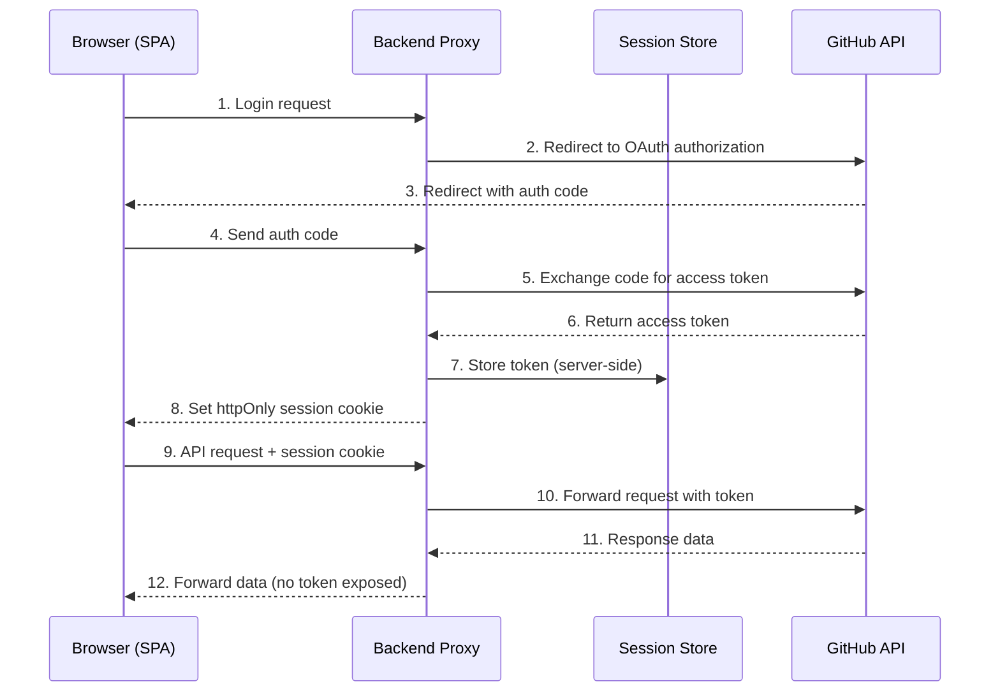

# Security Architecture

This document describes how the GitHub Markdown Viewer protects user data and authenticates requests. The application uses a backend proxy architecture where authentication tokens never reach the browser, ensuring credentials remain secure.

## Authentication Flows

### GitHub App OAuth Flow

The application supports authentication via the GitHub App OAuth flow:

1. **Authorization Redirect** — The user initiates login and the backend redirects the browser to GitHub's OAuth authorization page.
2. **Code Exchange** — After the user authorizes the application, GitHub redirects back with a temporary authorization code. The backend exchanges this code for an access token by communicating directly with GitHub's API.
3. **Session Creation** — The backend stores the access token server-side and issues a session cookie to the browser. The access token is never sent to the frontend.

### Personal Access Token (PAT) Authentication

As an alternative, users may authenticate with a Personal Access Token:

1. **Token Validation** — The user submits a PAT, and the backend validates it by making a request to the GitHub API to confirm the token is active and has appropriate scopes.
2. **Session Creation** — Upon successful validation, the backend stores the token server-side and issues a session cookie to the browser, identical to the OAuth flow.

## Project-Level Scoping

### GitHub App (OAuth)

Access is scoped at the repository level through GitHub's App installation page. The repository owner or organization admin selects which specific repositories the app can access during installation. The app cannot access any repository that has not been explicitly granted.

### Personal Access Token (PAT)

When creating a fine-grained PAT on GitHub, users select which repositories the token can access. Only the chosen repositories are available through this application. Users should follow the principle of least privilege and grant access only to the repositories they intend to browse.

## Sign Out

When a user signs out, the backend immediately deletes the stored session and associated access token from the server. The session cookie is cleared from the browser. After sign-out, the token can no longer be used to access the GitHub API — there is no lingering credential on either the client or the server.

## Token Storage

All authentication tokens (OAuth access tokens and PATs) are stored exclusively on the server side. The frontend never receives, stores, or has access to these tokens. This eliminates the risk of token theft via XSS or browser-based attacks.

## Backend Proxy Pattern

The application uses a backend proxy to communicate with the GitHub API on behalf of authenticated users:

- When the browser needs to access GitHub resources, it sends a request to the backend proxy along with its session cookie.
- The backend looks up the user's stored token using the session identifier and attaches it to the outgoing request to the GitHub API.
- The GitHub API response is forwarded back to the browser without exposing the token.

This pattern ensures tokens are only transmitted between the backend and GitHub, never between the browser and GitHub directly.

## Security Measures

### Session Cookies

Session identifiers are delivered to the browser as cookies with the following protective attributes:

- **httpOnly** — The cookie is not accessible to JavaScript, preventing XSS-based session theft.
- **Secure** — The cookie is only transmitted over HTTPS connections.
- **SameSite** — The cookie is restricted from being sent in cross-site requests, reducing CSRF risk.

### Hashed Session Identifiers

Session identifiers stored on the server are hashed using SHA-256. Even if the session store is compromised, the raw session IDs cannot be recovered from the stored hashes.

### CORS Protection

Cross-Origin Resource Sharing (CORS) is configured to restrict cross-origin requests to the configured frontend origin only. Requests from unauthorized origins are rejected by the backend.

### CSRF Protection

POST requests to the backend require a custom header. Browsers do not allow cross-origin requests to include custom headers without a CORS preflight, which blocks forged requests from malicious sites.

### Rate Limiting

Authentication endpoints are rate-limited to prevent brute-force attacks and abuse. Repeated failed authentication attempts from the same source are throttled.

## Data Flow Diagram

The following sequence diagram illustrates the OAuth authentication flow and subsequent API requests:

**Key observations:**

- Tokens flow only between the Backend Proxy and GitHub API — they never reach the Browser.
- The Browser communicates with the Backend using session cookies, not tokens.
- Token storage is entirely server-side in the Session Store.
